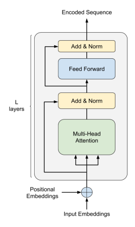
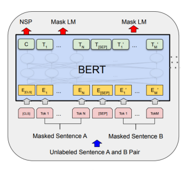
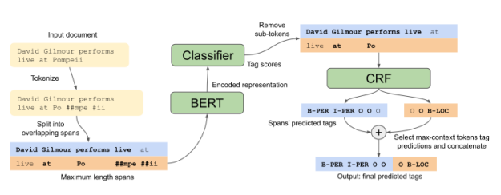

# Portuguese Named Entity Recognition Using Bert-Crf

F´abio Souza Rodrigo Nogueira Roberto Lotufo

| December 2019   |
|-----------------|

## 1 Introduction

Named entity recognition (NER) is a major task in Natural Language Processing (NLP)
that consists of identifying text spans that mention named entities (NEs) and classifying them into predefined categories. Common categories are person, organization, location, time and numerical expressions. By automatically extracting entities from plain text, NER is capable of providing some structure to originally unstructured textual data, making it accessible and interpretable. Aside from its importance as a standalone tool, NER
systems are also used as a preprocessing step in other NLP tasks, such as topic modeling, co-reference resolution and entity relation extraction [1].

Despite being conceptually simple, NER is not an easy task. The category of a named entity is highly dependent on textual semantics and on its surrounding context: the same named entity can have distinct categories due to subtle changes in its context.

Ambiguity and vagueness are inherent properties of natural language that introduce even more challenges to the task [2]. Moreover, there are many definitions of named entity and evaluation criteria, introducing evaluation complications [3].

Early NER systems were based on handcrafted rules, such as lexicons and ortographic features. They were followed by systems based on feature-engineering and machine learning approaches, that is, applying statistical models to task-specific engineered features
[1]. Starting with Collobert et al. [4], neural network NER systems have become popular due to its strong performance and higher domain and language independence, because of its minimal feature-engineering requirements. However, while earlier systems required labeled data only at evaluation stages, neural networks are often trained with thousands of manually labeled examples. This clearly has implications on many domains and languages where labeled data is scarce and labeling more data is prohibitively expensive or not feasible.

The most estabilished way to reduce the data requirements and improve the performance of neural networks is to resort to transfer learning techniques. Transfer learning consists of training a base model on a base dataset and task and then transfering the learned features to another model to be trained on a target task of interest [5]. The base dataset is generally much larger than the target dataset and the tasks are often related.

In computer vision, an effective recipe for transfer learning is to use a model pre-trained on ImageNet [6], which contains 1 million labeled images, and fine-tune it on the task of interest. This way, the model can leverage the learned representations from the base task and only a fraction of the model parameters have to be learned from scratch to the final task and dataset.

In NLP, the most common form of transfer learning is to use pre-trained word embeddings [7]. Word embeddings are dense vector word representations that capture syntatic and semantic word relationships, and they are learned by training on large amounts of unlabeled text data. However, the embeddings represent only the first layer of the models, so the remaining parameters have to be learned from scratch for every task and with limited labeled data. Fixed word embeddings also have limitations such as indifference to word order and inability to encode idiomatic phrases [8].

Current state-of-the-art NLP systems employ neural architectures that are pre-trained on language modeling tasks [9], such as ULMFiT [10], ELMo [11], OpenAI GPT [12]
and BERT [13]. Unlike the ImageNet recipe for computer vision, where the models are supervisely pre-trained with labeled examples, language modeling is a self-supervised task that requires only unlabeled text data that is freely available in most domains and languages.

Language modeling consists of estimating the joint probability for a sequence of words, which is often factorized into predicting the next word given a context of previous words, that is, P(x1*, . . . , x*T ) = QT
t=1 P(xt| x<t). A backward Language Model (LM) can be trained analogously by predicting the previous word given the context of future words.

The internal states of trained language models encode context sensitive word representations that can be transfered to downstream tasks. This deeper transfer of the learned language representation have been shown to significantly improve the performance on many NLP tasks [9, 10, 11, 12, 13] and also reduce the amount of labeled data needed for supervised learning [10, 11].

Applying these recent techniques to the Portuguese language can be highly valuable, given that annotated resources are scarce but unlabeled text data is abundant. In this work, we assess several neural architectures using BERT (Bidirectional Encoder Representation from Transformers) [13] models to the NER task in Portuguese. BERT is a language model based on Transformer Encoders [14] that, unlike preceding works that used unidirectional or a combination of unidirectional LMs, is designed to pre-train deep bidirectional word representations that are jointly conditioned on both left and right contexts. After the pre-training phase, the model is then finetuned on the final task of interest with minimal task-specific architecture modifications.

The models used in this work are composed of a pre-trained BERT and a classifier model. We explore two distinct strategies for BERT: finetuning and feature-based. In the finetuning strategy, both BERT and the classifier are finetuned to the final task. In the feature-based strategy, BERT is kept frozen and is used only to extract context-sensitive embeddings that are used as input for training the classifier model in the final task.

We also explore distinct BERT models. We use the Multilingual BERT released by Devlin et al. [13] and we also pre-train Portuguese BERT models that we make publicly available. These models are trained with the Brazilian Wikipedia and the brWaC corpus [15], a large Brazilian Portuguese corpus crawled from the internet.

The proposed architectures significantly outperform the previous published results on popular Portuguese NER datasets, on both feature-based and finetuning approaches. We also show that Portuguese BERT models outperform the Multilingual BERT on NER
even when not jointly finetuned to the task.

This work is organized as follows: Section 2 describes NER task modeling; Section 3 presents the related work on Portuguese NER; Section 4 has an overview of methods that are used throughout this work; our model architectures are presented on Section 5; in Section 6, we describe the datasets and our experimental setup. Finally, in Section 7 we

| Sentence                |       |       |     |      |    |            |    |       |    |
|-------------------------|-------|-------|-----|------|----|------------|----|-------|----|
| James                   | L     | .     | was | born | in | Washington | ,  | DC    | .  |
| Tagging in IOB2 scheme  |       |       |     |      |    |            |    |       |    |
| B-PER                   | I-PER | I-PER | O   | O    | O  | B-LOC      | O  | B-LOC | O  |
| Tagging in BILOU scheme |       |       |     |      |    |            |    |       |    |
| B-PER                   | I-PER | L-PER | O   | O    | O  | U-LOC      | O  | U-LOC | O  |

## 2 Named Entity Recognition

Named Entity Recognition is a major task in NLP that consists of identifying text spans that mentions named entities (NEs) and classifying them into predefined categories. There are a variety of definitions for the "named entity" expression, such as proper names and *rigid designators* [16]. These definitions, however, are often loosened for pratical reasons. General NE categories are person, organization, location, temporal expressions and numerical expressions, such as money, quantities of other units and percentages.

Domain-specific entity categories can also be defined, such as "protein", "chemical" and
"cell type" that are found in works in the biomedical field [16].

NER is most commonly modeled as a sequence tagging task that performs unified entity identification and classification. Given an input sequence of n tokens (x1, x2*, . . . , x*n),
the model has to output a sequence of tags (y1, y2*, . . . , y*n), where each token is assigned a tag of a predefined tag vocabulary according to a tagging scheme and the entity classes.

Each tagging scheme defines a tag vocabulary and tag transition constraints. The IOB2 tagging scheme defines the tags {B-, I-, O} . The B- tag indicates the beggining of an entity and I- marks succeeding tokens inside the same entity. The O tag is used for outside tokens that do not belong to entities. The IOBES/BILOU scheme extends IOB2 by including Ending/Last and Single/Unit tags. The E-/L- tag is used to mark an entity's final token and S-/U- marks single-token entities.

The final tag vocabulary is composed by the the O tag and the cartesian product of the remaining tags and the entity classes. This way, in IOB2 scheme, each class has its own B- and I- tags, allowing entity identification and classification to be performed jointly.

Tagging output examples for IOB2 and BILOU schemes are shown in Figure 1.

## 3 Related Work

Previous works on NER for Portuguese language explored machine learning techniques and a few ones applied neural networks models. do Amaral and Vieira [17] created a Conditional Random Fields (CRF) model using 15 features extracted from the central and surrounding words. Pirovani and Oliveira [18] followed a similar approach and combined a CRF model with Local Grammars.

The CharWNN model [19] extended the work of Collobert et al. [4] by employing a convolutional layer to extract character-level features from each word. These features are concatenated with pre-trained word embeddings and then used to perform sequential classification.

The LSTM-CRF architecture [20] has been commonly used in Portuguese general NER [21, 22] and also NER in the Legal domain [23]. The model is composed of two bidirectional LSTM networks that extract and combine character-level and word-level features. A sequential classification is then performed by the CRF layer. Several pretrained word embeddings settings and hyperparameters were explored by Castro et al.

[21] and Fernandes et al. [22] compared it to 3 other architectures.

Recent works also explored contextual embeddings extracted from language models in conjunction with the LSTM-CRF architecture. Santos et al. [24, 25] employs Flair Embeddings [26] that extract contextual word embeddings from a bidirectional characterlevel LM trained on Portuguese corpora. The Flair Embeddings are concatenated with pre-trained word embeddings and fed to a BiLSTM-CRF model. Castro et al. [27] uses ELMo (Embeddings from Language Models) [11] embeddings that are a combination of character-level features extracted by two CNNs (Convolutional Neural Networks) and the hidden states of each layer of a bidirectional LM (biLM) composed of a two-layered BiLSTM model.

## 4 Overview Of Methods

This section describes concepts and techniques that are used in NER and throughout this and related works in a bottom-up fashion.

## 4.1 Tokenization

Tokenization consists of converting a text into a sequence of known tokens that belong to a predefined vocabulary. Tokenization can be performed at word-level or subword-level, such as characters or subword units (sequences of characters of variable length).

## 4.1.1 Word-Level Tokenization

In word-level tokenization, the vocabulary is composed of entire words. Generally, the text is split at white space and punctuation characters and the resulting chunks are mapped to their indexes in the vocabulary. The vocabulary is formed by tokenizing the text corpora and removing "rare" words, that is, words whose frequencies are lower than an arbitrary threshold. The choice of the threshold affects the size of the vocabulary. Out-of-vocabulary (OOV) words are mapped to a single Unknown special token.

## 4.1.2 Character-Level Tokenization

In character-level tokenization, the vocabulary is composed of single characters. A text is treated as a sequence of characters and each character is mapped to its index in the vocabulary.

## 4.1.3 Subword-Level Tokenization

Subword-level tokenization, in its turn, has a vocabulary of subword units that can comprise characters, sequences of characters of variable length and even entire words. The tokenization process consists of segmenting the text into subword units (also refered to as subtokens or subword tokens from hereon). The vocabulary is often generated in a data-driven iterative process, such as the adapted Byte Pair Encoding (BPE) algorithm
[28]. In BPE, the vocabulary starts with characters, a text corpora is tokenized and the most frequent pair of symbols is merged and included in the vocabulary. This is repeated until a desired vocabulary size is reached. This method, along with character-level tokenization, is more robust to OOV words, since the worst case scenario when tokenizing an arbitrary word is to segment it into characters.

WordPiece [29] and SentencePiece [30] are examples of subword-level tokenization methods. In WordPiece, text is first divided into words and the resulting words are then segmented into subword units. For each segmented word, all units following the first one are prefixed with "\#\#" to indicate word continuation. SentencePiece takes an opposite approach: white space characters are replaced by a meta symbol " " (U+2581) and the sequence is then segmented into subword units. The meta symbol marks where words start.

## 4.2 Embeddings

The primary use of an embedding layer is to convert categorical sparse features into dense smaller vector representations. An Embedding layer can be seen as a lookup table and is defined by a matrix W ∈ R
V ×E, where V is the vocabulary size and E is the embedding dimension. The first layer of an NLP model is usually an embedding layer that is tightly associated to a tokenizer and its vocabulary. Each vocabulary token has an index that maps to a row vector w ∈ R
E of the embedding matrix W.

When associated with a word-level tokenizer, the weights of an embedding layer are often called Word embeddings and are usually initialized with pre-trained values. Pretrained Word embeddings are available for several languages and training algorithms, such as Word2Vec, GloVe, Wang2Vec, etc. When using pre-trained word embeddings, it is essential to keep the same tokenization and normalization rules that were adopted in the pre-training procedure.

Aside from word embeddings, models may have multiple embedding layers to encode distinct categorical features.

## 4.3 Long Short-Term Memory (Lstm)

The LSTM [31] is a recurrent architecture proposed to overcome the exploding and vanishing gradients problem in Recurrent Neural Networks (RNNs). It has become widely estabilished and is extensively used in a variety of NLP tasks. Given an input sequence
(x1*, . . . , x*n), the states of a one-layer LSTM for each element xtis given by it = σ(Wiixt + bii + Whiht−1 + bhi)
ft = σ(Wifxt + bif + Whfht−1 + bhf )
gt = *tanh*(Wigxt + big + Whght−1 + bhg) ot = σ(Wioxt + bio + Whoht−1 + bho)
ct = ft ∗ ct−1 + it ∗ gt ht = ot ∗ *tanh(c*t) (1)
where htis the hidden state at time t, ctis the cell state at time t, and it, ft, gt and ot are the input, forget, cell and output gates, respectively. σ(·) is the sigmoid function and ∗
is the Hadamard product. W are weight matrices and b are bias terms.

$\left(1\right)$. 
$$\mathfrak{a}(C_{t})$$
A bidirectional LSTM (biLSTM) consists of two independent LSTMs, a forward and a backward LSTM, whose hidden states are concatenated to form the final output sequence.

The forward LSTM sees the input sequence from left to right, while the backward LSTM
sees the input in reversed order.

## 4.4 Self-Supervised Learning

Self-supervised learning are tasks that are trained with supervision but do not require datasets with manually labeled examples. In other words, the labeled examples can be automatically extracted or generated from unlabeled data. Examples of self-supervision tasks are auto-encoders, super resolution, denoising and language modeling.

## 4.5 Language Modeling

The task of language modeling consists of estimating the joint probability of a sequence of tokens, P(x1*, . . . , x*T ). In neural language modeling, it is often factorized as

$$P(\mathbf{x})=\prod_{t=1}^{T}P(x_{t}\mid x_{1},\ldots,x_{t-1})=\prod_{t=1}^{T}P(x_{t}\mid\mathbf{x}_{<t}).\tag{2}$$  on the problem reduces to estimating each conditional factor, that is 
With the factorization, the problem reduces to estimating each conditional factor, that is, predicting the next token given a history of previous tokens. This formulation results in a forward language model (LM). A backward LM sees the tokens in reversed order, which results in predicting the previous token given the future context, P(xt| x>t).

## 4.6 Attention Mechanisms

The attention mechanism [32] was first proposed in neural machine translation to enable models to relate signals from arbitrary positions in long sequences using a constant number of operations. Let q be a query vector and (ki, vi) be key-value vector pairs. The output of an attention mechanism is a weighted sum of the values,

$$a=\sum_{i}\alpha_{i}\mathbf{v}_{i}$$

where αiis the weight associated to value vi. The weights are computed by

$$\alpha_{i}=\frac{\exp(g({\bf q},{\bf k}_{i}))}{\sum_{i^{\prime}}\exp(g({\bf q},{\bf k}_{i}^{\prime}))}\tag{3}$$

where g is a scoring or compatibility function that is calculated with the query and all keys.

## 4.6.1 Scaled Dot-Product Attention

In Dot-Product attention [33], the compatibility function is the dot-product of query and key vectors:

$$g(\mathbf{q},\mathbf{k}_{i})=\mathbf{q}^{\mathsf{T}}\mathbf{k}_{i}$$

Vaswani et al. [14] introduced an scaling fator into the dot-product attention:

$$g(\mathbf{q},\mathbf{k}_{i})={\frac{\mathbf{q}^{\mathsf{T}}\mathbf{k}_{i}}{\sqrt{d_{k}}}}$$
$$\left({4}\right)$$

$$\left({\bar{5}}\right)$$
√dk(4)
where dk is the dimension of the query and key vectors. The scaling factor was included to reduce the magnitude of the dot products for large values of dk, which could push the softmax function (see Eq. 3) into regions where it has small gradients [14].

In practice, attention can be computed on a set of queries simultaneously if the queries, keys and values are packed in matrices. Let Q, K and V be the query, key and value matrices. The matrix of outputs is computed by:

$$\operatorname{Attention}(\mathbf{Q},\mathbf{K},\mathbf{V})=\operatorname{Softmax}\left({\frac{\mathbf{Q}\mathbf{K}^{\intercal}}{\sqrt{d_{k}}}}\right)\mathbf{V}$$
$$\left({\mathrm{6}}\right)$$

## 4.6.2 Multi-Head Attention

Multi-head attention [14] consists of performing several attention functions in parallel for h individual heads, and then combining its outputs. To keep computational cost constrained, one can apply linear projections on the queries, keys and values to reduced dimensions dq, dk and dv, respectively. The Multi-Head Attention can be defined as:

$\begin{array}{l}\mbox{MultiHead}({\bf Q},{\bf K},{\bf V})=[head_{1};\ldots;head_{h}]W^{O}\\ \mbox{where}\quad head_{i}=\mbox{Attention}({\bf QW}_{i}^{Q},{\bf KW}_{i}^{K},{\bf VW}_{i}^{V})\end{array}$

where [ · ] is concatenation operation, WQ
i ∈ R
di×dq, WK
i ∈ R
di×dk , WV
i ∈ R
di×dv, WO ∈ R
hdv×do, and di and do are the input and output dimensions, respectively. In dot-product attention, dk = dq.

## 4.7 Bert

BERT (Bidirectional Encoder Representation from Transformers) [13] is a language model based on Transformer Encoders [14] that, unlike preceding works that used unidirectional or a combination of unidirectional LMs, is designed to pre-train deep bidirectional word representations that are jointly conditioned on both left and right contexts. BERT overcomes this limitation by using a modified language model objective called Masked Language Modeling that resembles a denoising objetive. After the pre-training phase, the model can be finetuned on the final task of interest with minimal task-specific architecture modifications.

BERT's architecture is Transformer Encoder composed of L identical Encoder layers.

The Transformer Encoder and its components are described in the next subsections.

## 4.7.1 Transformer Encoder

The Transfomer Encoder is part of the Transformer architecture proposed by Vaswani et al. [14] as an alternative to estabilished recurrent models, such as LSTM. The main motivation behind the Transformer is enabling significantly more parallelization by relying entirely on attention mechanisms instead of recurrent models that are inherently sequential. This sequential nature hinders parallelization inside a single training example, while longer sequence lengths impede parallelization across examples due to memory constraints [14].

A Transformer Encoder maps an input sequence of tokens x = (x1*, . . . , x*n) to a sequence of embedded representations z = (zi*, . . . , z*n). The encoder is composed of a stack of L identical layers. Each encoder layer has two sub-layers: a Multi-Head Self-Attention and a Feed Forward Layer. Each sub-layer has a residual connection and is followed by layer normalization [34], that is, the output of a sublayer is Sublayer(layer, x) = LayerNorm(x + layer(x)),
where *layer*(·) is either a Multi-Head Self-Attention or a Feed Forward Layer. To facilitate the residual connections, both sub-layers' inputs and outputs have dimension d*model*.

A diagram of the Transformer Encoder is shown in Figure 2.

The multi-head self-attention layer receives as input the output of the previous encoder layer. These inputs are used as queries, keys and values, hence the name self-attention.

In this manner, any position in the encoder can attend to all positions of the previous encoder layer. The layer has A heads and uses di = do = H and dk = dv = H/A.

The Feed Forward layer, in its turn, is composed of two consecutive fully-connected layers that is parameterized as

## Fnn(X) = Act(Xw1 + B1)W2 + B2

where Act(·) is an activation function that is ReLU in the original Transformer and GeLU
[35] in BERT. This layer is applied to each position of its input separately and identically, as opposed to the attention that sees all positions simultaneously. The inner-layer has dimensionality df f . The output zi of the i-th Encoder layer is given by yi = LayerNorm(MultiHead(zi−1, zi−1, zi−1) + zi−1)
zi = LayerNorm(FFN(yi) + yi) (7)
Dropout is applied at the output of each sub-layer, before the residual connection and normalization.

## 4.7.2 Positional Encoding

Since the Transformer model does not contain recurrence or any operation that is affected by the sequence order, such as convolution, some information about the relative or absolute position of the tokens in a sequence has to be included at the input. The positional encoding can be fixed features or learned embeddings. The original Transformer uses fixed absolute encodings given by

$\left(7\right)$. 
$$\begin{array}{c}{{P E(\mathrm{pos},2i)=s i n(\mathrm{pos}/10000^{2i/H})}}\\ {{P E(\mathrm{pos},2i+1)=c o s(\mathrm{pos}/10000^{2i/H})}}\end{array}$$
where pos ∈ {1*, . . . , S*} is the token position in a sequence of length S and i ∈ {1*, . . . , H*}
is the dimension. These encodings are summed to the embeddings at the input of Encoder stack.

BERT opted to use learned absolute positional embeddings, despite both approaches having similar performances [14]. The drawback of using learned positional embeddings is that the input sequence length S is fixed and limited to the maximum sequence length defined at the pre-training phase, while the absolute encodings can be teoretically extended to larger input sequence lengths [14].

## 4.7.3 Input And Output Representation

The input of BERT is constructed using special tokens to indicate the beginning of a sequence and the boundaries of independent sentences1inside a sequence. The [CLS]
token is the first token of every sequence. When the input sequence is composed of more than one sentence, such as in the pre-training stage, the tokens of each sentence are concatenated with [SEP] tokens inserted in between different sentences. In addition to the [SEP] token, segment embeddings are summed to the token embeddings to indicate from which sentence a token belongs to. The input representation of each token xiis computed by

$\mathbf{x_i}=\mathrm{Emb}(x_i)+\mathrm{PositionalEmb}(x_i)+\mathrm{SegmentationEmb}(x_i)$. 
where Emb is the token embedding, PositionalEmb is the positional embedding and SegmentationEmb is the segmentation embedding, all of dimension R
H.

The encoded representation of the [CLS] token, C ∈ R
H, is used for classification tasks in pre-training and fine-tuning stages. The encoded representation of each token is represented as Ti ∈ R
H and are used in token-level tasks. Figure 3 shows the overall pre-training procedure and serves as example for this and the next subsections.

1Sentence here is actually a sequence of words that can contain many contiguous actual sentences.

$$\mathrm{{tionEmb}}(x_{i})$$

## 4.7.4 Pre-Training Procedure

The input for the pre-training stage is composed by a sentence pair (A,B) that is packed together in a single sequence. The pre-training procedure uses two distinct loss functions that are summed to compose the final loss: Masked Language Modeling (MLM) and Next Sentence Prediction (NSP). The standard conditional language modeling described in Section 4.5 cannot be used in bidirectional conditioning, since a Transformer Encoder Layer can see all tokens of the previous layer, and, hence, each word would be able to
"see itself" in a multi-layered setup [13].

Masked Language Modeling In MLM, instead of predicting the next token given a context of previous tokens, the input sequence is corrupted by randomly masking 15%
of the words and the whole sequence is fed to the model. The masked tokens are (1)
replaced by a [MASK] token 80% of the time, or (2) replaced by a random token 10% of the time or (3) left unchanged 10% of the time. The final encoded representation of the masked tokens, Ti, are then fed into an output softmax over the vocabulary, as in standard LM, and used to predict the original masked tokens with cross entropy loss.

Next Sentence Prediction The NSP task, in its turn, is a binary classification task whose objective is to predict if the sentence B is the actual sentence that follows sentence A (labeled as IsNext) or if it is a random sentence from the corpus (labeled as NotNext). The input examples are constructed in a balanced manner, where sentence B
is a continuation of sentence A 50% of the time. The final hidden representation of the
[CLS] token, C, is used for this task, as shown in Figure 3.

## 5 Proposed Model Architectures For Ner

This section describes the proposed model architectures and the training and evaluation procedures.

## 5.1 Bert-Crf For Ner

The model architecture is composed of a BERT model followed by a classifier model and a Linear-Chain CRF. BERT allows input sequences of up to S tokens and outputs an encoded token sequence with hidden dimension H. The classification model projects each token's encoded representation to the tag space, i.e. R
H 7→ R
K, where K is the number of tags and depends on the the number of classes and on the tagging scheme. The output scores of the classification model, P, are then fed to the CRF layer, whose parameters are a matrix of tag transitions A ∈ R
K+2,K+2. The matrix A is such that Ai,j represents the score of transitioning from tag i to tag j. A includes 2 additional states: start and end of sequence.

As described by Lample et al. [20], for an input sequence X = (x1, x2*, ...,* xn) and a sequence of tag predictions y = (y1, y2*, ..., y*n), the score of the sequence is defined as

$$s(\mathbf{X},\mathbf{y})=\sum_{i=0}^{n}A_{y_{i},y_{i+1}}+\sum_{i=1}^{n}P_{i,y_{i}},$$

where y0 and yn+1 are start and end tags, respectively, and Pi,yi is the score of tag yifor the *i-th* token. During training, the model is optimized by maximizing the log-probability of the correct tag sequence, which follows from applying softmax over all possible tag sequences' scores:

$$\log(p({\bf y}|{\bf X}))=s({\bf X},{\bf y})-\log\left(\sum_{{\bf\hat{y}}\in{\bf Y_{\bf X}}}e^{s({\bf X},{\bf\hat{y}})}\right)\tag{9}$$

where YX are all possible tag sequences. The summation in Eq. 9 is computed using dynamic programming. During evaluation, the most likely sequence is obtained by Viterbi decoding. It is important to note that, as described in Devlin et al. [13], WordPiece tokenization requires predictions and losses to be computed only for the first sub-token of each token.

## 5.2 Feature-Based And Finetuning Approaches

We experiment with two transfer learning approaches: *feature-based* and finetuning. For the feature-based approach, the BERT model weights are kept frozen and only the classifier model and CRF layer are trained. The classifier model consists of a 1-layer BiLSTM
with hidden size d*LSTM* followed by a Linear layer. Instead of using only the last hidden representation layer of BERT, we sum the last 4 layers, following Devlin et al. [13].

The resulting architecture resembles the LSTM-CRF model [20] replacing its embedding techniques by BERT.

As for the finetuning approach, the classifier is a linear layer and all weights are updated jointly during training. For both approaches, models without the CRF layer were also evaluated. In this case, they were optimized by minimizing the cross entropy loss using P directly.

## 5.3 Document Context And Max Context Evaluation

To benefit the most from the bidirectional context present in the tokens' encoded representation provided by BERT, we use document context for input examples instead of sentence context. Following the approach of Devlin et al. [13] on the SQuAD dataset, examples larger than S tokens are broken into spans of length up to S using a stride of D tokens. Each span is used as a separate example during training. During evaluation, however, a single token Ti can be present in N =
S
D multiple spans sj and so may have up to N distinct tag predictions yi,j . Each token's final prediction is taken from the span where the token is closer to the central position, that is, the span where it has the most contextual information. Figure 4 shows an outline of the evaluation procedure.

## 6 Experiments

This section describes the BERT pre-training and NER training experimental setups.

## 6.1 Pre-Training Experiments

Portuguese BERT models are trained for the two model sizes defined in Devlin et al. [13]: BERT Base (N=12, H=768, A=12) and BERT Large (N=24, H=1024, A=16). For both sizes, df f = 4H, p*dropout* = 0.1, and the maximum sentence length is set to S = 512 tokens. We train cased models only, as capitalization is relevant for NER.

## 6.1.1 Vocabulary Generation

A Portuguese vocabulary of 30k cased subword units is generated using SentencePiece with BPE algorithm and 200k random Brazilian Wikipedia articles. The generated vocabulary is then converted to WordPiece following BERT's tokenization rules. Firstly, all BERT special tokens are inserted ([CLS], [MASK], [SEP], and [UNK]) and all punctuation characters of the Multilingual vocabulary are added to Portuguese vocabulary. Then, since BERT splits the text at whitespace and punctuation prior to applying WordPiece tokenization in the resulting chunks, each SentencePiece token that contains punctuation characters is split at these characters, the punctuations are removed and the resulting subword units are added to the vocabulary 2. Finally, subword units that do not start with " " are prefixed with "\#\#" and " " characters are removed from the remaining tokens.

## 6.1.2 Pre-Training Data

The pre-training stage requires and benefits from large amounts of unlabeled data, preferably from a document-level corpus instead of a sentence-level corpus, because it allows creating sequences composed of multiple contiguous sentences. This way, the model can learn long range dependencies. We use the brWaC corpus [15], a large Brazilian Portuguese corpus crawled from the internet, which contains 2.68 billion tokens from 3.53 million documents and is the largest open Portuguese corpus to date. Aside from its size, the brWaC contains of whole documents and its methodology ensures high domain diversity and content quality. We use only the document body (ignoring the titles) and we apply a single post-processing step on the brWaC data to remove *mojibakes*3 and remnant HTML tags using the *ftfy* library [36]. The final processed corpus has 17.5GB of raw text.

## 6.1.3 Pre-Training Setup And Hyperparameters

We follow the pre-training setup of Devlin et al. [13] using the released code4. The input sequences are generated with default parameters (maximum of 20 predictions for MLM
per sequence) and use whole work masking (if a word composed of multiple subword units is masked, all of its subword units are masked and have to be predicted in MLM task).

The models are trained for 1,000,000 steps. We use a learning rate of 1e-4, learning rate warmup over the first 10,000 steps followed by a linear decay of the learning rate.

For BERT Base models, the weights are initialized with the checkpoint of Multilingual BERT Base. We use a batch size of 128 and sequences of 512 tokens the entire training. This training takes 4 days on a TPUv3-8 instance and performs about 8 epochs over the training data.

For BERT Large, the weights are initialized with the checkpoint of English BERT
Large. Since it is a bigger model with longer training time, we follow the instructions of Devlin et al. [13] and use sequences of 128 tokens in batches of size 256 for the first 900,000 steps and then sequences of 512 tokens and batch size 128 for the last 100,000 steps. This training takes 7 days on a TPUv3-8 instance and performs about 6 epochs over the training data.

Note that in the calculation of the number of epochs, we are taking into consideration a duplication factor of 10 when generating the input examples. This means that under 10 epochs, the same sentence is seen with different masking and sentence pair in each epoch, which effectively is equal to dynamic example generation.

## 6.2 Ner Experiments

In this section, we present the NER datasets, the training setup and hyperparameters.

## 6.2.1 Datasets

The standard datasets for training and evaluating Portuguese NER task are the HAREM
Golden Collections (GC) [2, 37]. We use the GCs of the First HAREM evaluation contests, which is divided in two subsets: First HAREM and MiniHAREM. Each GC contains manually annotated named entities of 10 classes: Location, Person, Organization, Value, Date, Title, Thing, Event, Abstraction and Other.

We use the GC of First HAREM as training set and the GC of MiniHAREM as test set. The experiments are conducted on two scenarios: a Selective scenario, with 5 entity classes (Person, Organization, Location, Value and Date) and a Total scenario, that considers all 10 classes. This is the same setup used by Santos and Guimaraes [19]
and Castro et al. [21].

Vagueness and indeterminacy: some text segments of the GCs contain <ALT>
tags that enclose multiple alternative named entity identification solutions. Additionally, multiple categories may be assigned to a single named entity. These criteria were adopted in order to take into account vagueness and indeterminacy that can arise in sentence interpretation [37].

Despite enriching the datasets by including such realistic information, these aspects introduce benchmarking and reproducibility complications when the datasets are used in single-label setups, since they imply the adoption of heuristics to select one unique solution for each vague or undetermined segment and/or entity. To resolve each <ALT> tag in the datasets, our approach is to select the alternative that contains the highest number of named entities. In case of ties, the first one is selected. To resolve each named entity that is assigned multiple classes, we simply select the first valid class for the scenario.

## 6.2.2 Ner Training Setup

For NER training, we use 3 distinct BERT models: Multilingual BERT-Base5, Portuguese BERT-Base and Portuguese BERT-Large. The Multilingual BERT was trained on 104 languages and has a vocabulary of 119547 WordPiece tokens. We use the PyTorch BERT
implementation by HuggingFace6. A stride of D = 128 tokens is used to split the input examples into spans, as described in 5.3. We use the IOB2 tagging scheme.

The model parameters were divided in two groups with different learning rates: 5e-5 for BERT model and 1e-3 for the rest. The numbers of epochs are 100 for BERT-LSTM,
50 for BERT-LSTM-CRF and BERT, and 15 for BERT-CRF. The number of epochs was found using a development set comprised of 10% of the First HAREM training set. We use a batch of size 16 and the customized Adam optimizer of Devlin et al. [13]. As in the pre-training, we use learning rate warmup for the first 10% of steps and linear decay of the learning rate.

Architecture Total scenario Selective scenario

Prec. Rec. F1 Prec. Rec. F1

CharWNN [19] 67.16 63.74 65.41 73.98 68.68 71.23

LSTM-CRF [21] 72.78 68.03 70.33 78.26 74.39 76.27

BiLSTM-CRF+FlairBBP [25] 74.91 74.37 74.64 83.38 81.17 82.26

ML-BERTBASE-LSTM † 69.68 69.51 69.59 75.59 77.13 76.35

ML-BERTBASE-LSTM-CRF † 74.70 69.74 72.14 80.66 75.06 77.76

ML-BERTBASE 72.97 73.78 73.37 77.35 79.16 78.25 ML-BERTBASE-CRF 74.82 73.49 74.15 80.10 78.78 79.44

PT-BERTBASE-LSTM † 75.00 73.61 74.30 79.88 80.29 80.09

PT-BERTBASE-LSTM-CRF † 78.33 73.23 75.69 84.58 78.72 81.66

PT-BERTBASE 78.36 77.62 77.98 83.22 82.85 83.03

PT-BERTBASE-CRF 78.60 76.89 77.73 83.89 81.50 82.68

PT-BERTLARGE-LSTM † 72.96 72.05 72.50 78.13 78.93 78.53

PT-BERTLARGE-LSTM-CRF † 77.45 72.43 74.86 83.08 77.83 80.37

PT-BERTLARGE 78.45 77.40 77.92 83.45 83.15 83.30 PT-BERTLARGE-CRF 80.08 77.31 78.67 84.82 81.72 83.24

Table 1: Comparison of Precision, Recall and F1-scores results on the test set (MiniHAREM). Reported values are the average of 5 runs. All metrics were calculated using the CoNLL 2002 evaluation script. The greatest values of each column are in bold.

†: feature-based approach.

For the feature-based approach, we use a biLSTM with 1 layer and hidden dimension of d*LSTM* = 100 units for each direction.

To deal with class imbalance, we initialize the bias term of the "O" tag in the linear layer of the classifier with value of 6 in order to promote a better stability in early training
[38]. We also use a weight of 0.01 for "O" tag losses when not using a CRF layer.

When evaluating, we apply a post-processing step that removes all invalid tag predictions for the IOB2 scheme, such as "I-" tags coming directly after "O" tags or after an "I-" tag of a different class. This post-processing step trades off recall for a possibly higher precision.

## 7 Results

The main results of our experiments are presented in Table 1. We compare the performances of ourmodels on the two scenarios (total and selective) to the works of Santos and Guimaraes [19], Castro et al. [21] and Santos et al. [25]. To make the results comparable to these works, all metrics are computed using CoNLL 2002 evaluation script 7, that consists of an entity-level micro F1-score considering only strict exact matches.

Our proposed Portuguese BERT-CRF model outperforms the previous state-of-theart on both the total and selective scenarios, improving the F1-score by about 1 point on the selective scenario and by 4.0 points on the total scenario over the BiLSTMCRF+FlairBBP model [25]. We note that even though the BiLSTM-CRF+FlairBBP
also uses contextual embeddings from LMs and was pretrained with 70% more unlabeled 7https://www.clips.uantwerpen.be/conll2002/ner/bin/conlleval.txt data, its language models are not jointly conditioned on the left and right contexts like BERT. Interestingly, Flair embeddings outperforms BERT models on English NER [26].

We also report results removing the CRF layer in order to evaluate the performance of BERT and BERT-LSTM models. Portuguese BERT also outperforms previous works, even without the enforcement of sequential classification provided by the CRF layer.

Models with CRF consistently improves or performes similarly to its simpler variants when comparing the overall F1 scores. We note that in most cases they show higher precision scores but lower recall.

While finetuned Portuguese BERTLARGE models are the highest performers in both scenarios, we observe that it experiences performance degradation when used in the feature-based approach, performing worse than its smaller variant but still better than the Multilingual BERT. In addition, it can be seen that the BERTLARGE models do not bring much improvement to the selective scenario when compared to BERTBASE models.

We hypothesize that it is due to the small size of the NER dataset.

The models of the feature-based approach perform significantly worse compared to the ones of the fine-tuning approach, as expected. The post-processing step of filtering out invalid transitions for the IOB2 scheme increases the F1-scores by 2.24 and 1.26 points, in average, for the feature-based and fine-tuning approaches, respectively. This step produces a reduction of 0.44 points in the recall, but boosts the precision by 3.85 points, in average.

## 8 Next Steps

Topics 2019 2020

Jul-Sep Oct-Dec Jan-Mar

BERT pre-trainings x x

Portuguese BERT experiments x x x

Comparative analysis x x

For next steps, we aim to perform a broader comparative analysis of the results, such

as evaluating test performance on words seen during training versus new words. Other

possible contribution can be to modify the used CRF layer implementation to ensure only

valid sequences are produced during evaluation.

## 9 Conclusion

We present a new state-of-the-art on the HAREM I corpora by pre-training Portuguese BERT models on large corpus of unlabeled text and fine-tuning a BERT-CRF architecture on the Portuguese NER task. We show that our proposed model outperforms the LSTMCRF architecure without contextual embeddings by 8.3 and 7.0 absolute points on F1score on total and selective scenarios, respectively. When comparing to the BiLSTMCRF+FlairBBP model, that uses contextual embeddings from a character-level language model, BERT-CRF shows an improvement of 1.0 absolute point on the selective scenario and a large gap of 4.0 absolute points on the total scenario, even though it was pre-trained on much less data. Considering the issues regarding preprocessing and dataset decisions that affect evaluation compatibility, we gave special attention to reproducibility of our results by making our code and models publicly available.

## References

[1] Vikas Yadav and Steven Bethard. A survey on recent advances in named entity recognition from deep learning models. In *Proceedings of the 27th International* Conference on Computational Linguistics, pages 2145–2158, 2018.

[2] Cl´audia Freitas, Paula Carvalho, Hugo Gon¸calo Oliveira, Cristina Mota, and Diana Santos. Second harem: advancing the state of the art of named entity recognition in portuguese. In *quot; In Nicoletta Calzolari; Khalid Choukri; Bente Maegaard; Joseph* Mariani; Jan Odijk; Stelios Piperidis; Mike Rosner; Daniel Tapias (ed) Proceedings of the International Conference on Language Resources and Evaluation (LREC 2010)(Valletta 17-23 May de 2010) European Language Resources Association. European Language Resources Association, 2010.

[3] M´onica Marrero, Juli´an Urbano, Sonia S´anchez-Cuadrado, Jorge Morato, and Juan Miguel G´omez-Berb´ıs. Named entity recognition: fallacies, challenges and opportunities. *Computer Standards & Interfaces*, 35(5):482–489, 2013.

[4] Ronan Collobert, Jason Weston, L´eon Bottou, Michael Karlen, Koray Kavukcuoglu, and Pavel Kuksa. Natural language processing (almost) from scratch. *Journal of* machine learning research, 12(Aug):2493–2537, 2011.

[5] Jason Yosinski, Jeff Clune, Yoshua Bengio, and Hod Lipson. How transferable are features in deep neural networks? In Advances in neural information processing systems, pages 3320–3328, 2014.

[6] Jia Deng, Wei Dong, Richard Socher, Li-Jia Li, Kai Li, and Li Fei-Fei. Imagenet: A
large-scale hierarchical image database. In *2009 IEEE conference on computer vision* and pattern recognition, pages 248–255. Ieee, 2009.

[7] Tomas Mikolov, Kai Chen, Greg Corrado, and Jeffrey Dean. Efficient estimation of word representations in vector space. *arXiv preprint arXiv:1301.3781*, 2013.

[8] Tomas Mikolov, Ilya Sutskever, Kai Chen, Greg S Corrado, and Jeff Dean. Distributed representations of words and phrases and their compositionality. In *Advances* in neural information processing systems, pages 3111–3119, 2013.

[9] Andrew M Dai and Quoc V Le. Semi-supervised sequence learning. In *Advances in* neural information processing systems, pages 3079–3087, 2015.

[10] Jeremy Howard and Sebastian Ruder. Universal language model fine-tuning for text classification. In *Proceedings of the 56th Annual Meeting of the Association for Computational Linguistics (Volume 1: Long Papers)*, pages 328–339, 2018.

[11] Matthew Peters, Mark Neumann, Mohit Iyyer, Matt Gardner, Christopher Clark, Kenton Lee, and Luke Zettlemoyer. Deep contextualized word representations. In Proceedings of the 2018 Conference of the North American Chapter of the Association for Computational Linguistics: Human Language Technologies, Volume 1 (Long Papers), pages 2227–2237, 2018.
[12] Alec Radford, Karthik Narasimhan, Time Salimans, and Ilya Sutskever. Improving language understanding with unsupervised learning. Technical report, Technical report, OpenAI, 2018.

[13] Jacob Devlin, Ming-Wei Chang, Kenton Lee, and Kristina Toutanova.

Bert: Pre-training of deep bidirectional transformers for language understanding. *Computing Research Repository*, arXiv:1810.04805, 2018. URL
http://arxiv.org/abs/1810.04805.

[14] Ashish Vaswani, Noam Shazeer, Niki Parmar, Jakob Uszkoreit, Llion Jones, Aidan N.

Gomez, Lukasz Kaiser, and Illia Polosukhin. Attention is all you need, 2017.

[15] Jorge Wagner Filho, Rodrigo Wilkens, Marco Idiart, and Aline Villavicencio. The brwac corpus: A new open resource for brazilian portuguese. 05 2018.

[16] David Nadeau and Satoshi Sekine. A survey of named entity recognition and classification. *Lingvisticae Investigationes*, 30(1):3–26, 2007.

[17] Daniela Oliveira F do Amaral and Renata Vieira. Nerp-crf: A tool for the named entity recognition using conditional random fields. *Linguam´atica*, 6(1):41–49, 2014.

[18] Juliana Pirovani and Elias Oliveira. Portuguese named entity recognition using conditional random fields and local grammars. In Proceedings of the Eleventh International Conference on Language Resources and Evaluation (LREC-2018), 2018.

[19] Cicero Nogueira dos Santos and Victor Guimaraes. Boosting named entity recognition with neural character embeddings. *Computing Research Repository*,
arXiv:1505.05008, 2015. URL https://arxiv.org/abs/1505.05008. version 2.

[20] Guillaume Lample, Miguel Ballesteros, Sandeep Subramanian, Kazuya Kawakami, and Chris Dyer. Neural architectures for named entity recognition. *Computing Research Repository*, arXiv:1603.01360, 2016. URL
http://arxiv.org/abs/1603.01360. version 3.

[21] Pedro Vitor Quinta de Castro, N´adia F´elix Felipe da Silva, and Anderson da Silva Soares. Portuguese named entity recognition using lstm-crf. In Aline Villavicencio, Viviane Moreira, Alberto Abad, Helena Caseli, Pablo Gamallo, Carlos Ramisch, Hugo Gon¸calo Oliveira, and Gustavo Henrique Paetzold, editors, *Computational Processing of the Portuguese Language*, pages 83–92, Cham, 2018. Springer International Publishing. ISBN 978-3-319-99722-3.

[22] Ivo Fernandes, Henrique Lopes Cardoso, and Eugenio Oliveira. Applying deep neural networks to named entity recognition in portuguese texts. In 2018 Fifth International Conference on Social Networks Analysis, Management and Security (SNAMS), pages 284–289. IEEE, 2018.

[23] Pedro Henrique Luz de Araujo, Te´ofilo E de Campos, Renato RR de Oliveira, Matheus Stauffer, Samuel Couto, and Paulo Bermejo. Lener-br: A dataset for named entity recognition in brazilian legal text. In *International Conference on Computational Processing of the Portuguese Language*, pages 313–323. Springer, 2018.

[24] Joaquim Santos, Juliano Terra, Bernardo Scapini Consoli, and Renata Vieira. Multidomain contextual embeddings for named entity recognition. In *IberLEF@SEPLN*,
2019.

[25] Joaquim Santos, Bernardo Consoli, Cicero dos Santos, Juliano Terra, Sandra Collonini, and Renata Vieira. Assessing the impact of contextual embeddings for portuguese named entity recognition. In 8th Brazilian Conference on Intelligent Systems, BRACIS, Bahia, Brazil, October 15-18, pages 437–442, 2019.

[26] Alan Akbik, Duncan Blythe, and Roland Vollgraf. Contextual string embeddings for sequence labeling. In *COLING 2018, 27th International Conference on Computational Linguistics*, pages 1638–1649, 2018.

[27] Pedro Castro, Nadia Felix, and Anderson Soares. Contextual representations and semi-supervised named entity recognition for portuguese language. 09 2019.

[28] Rico Sennrich, Barry Haddow, and Alexandra Birch. Neural machine translation of rare words with subword units. In Proceedings of the 54th Annual Meeting of the Association for Computational Linguistics (Volume 1: Long Papers), pages 1715–
1725, Berlin, Germany, August 2016. Association for Computational Linguistics. doi:
10.18653/v1/P16-1162.

[29] Yonghui Wu, Mike Schuster, Zhifeng Chen, Quoc V Le, Mohammad Norouzi, Wolfgang Macherey, Maxim Krikun, Yuan Cao, Qin Gao, Klaus Macherey, et al. Google's neural machine translation system: Bridging the gap between human and machine translation. *Computing Research Repository*, arXiv:1609.08144, 2016. URL
http://arxiv.org/abs/1609.08144. version 2.

[30] Taku Kudo and John Richardson. Sentencepiece: A simple and language independent subword tokenizer and detokenizer for neural text processing, 2018.

[31] Sepp Hochreiter and J¨urgen Schmidhuber. Long short-term memory. *Neural computation*, 9(8):1735–1780, 1997.

[32] Dzmitry Bahdanau, Kyunghyun Cho, and Yoshua Bengio. Neural machine translation by jointly learning to align and translate, 2014.

[33] Thang Luong, Hieu Pham, and Christopher D. Manning. Effective approaches to attention-based neural machine translation. In *Proceedings of the 2015 Conference on Empirical Methods in Natural Language Processing*, pages 1412–1421, Lisbon, Portugal, September 2015. Association for Computational Linguistics. doi:
10.18653/v1/D15-1166.

[34] Jimmy Lei Ba, Jamie Ryan Kiros, and Geoffrey E. Hinton. Layer normalization, 2016.

[35] Dan Hendrycks and Kevin Gimpel. Gaussian error linear units (gelus). arXiv preprint arXiv:1606.08415, 2016.

[36] Robyn Speer. ftfy. Zenodo, 2019. URL
https://doi.org/10.5281/zenodo.2591652. Version 5.5.

[37] Diana Santos, Nuno Seco, Nuno Cardoso, and Rui Vilela. Harem: An advanced ner evaluation contest for portuguese. 2006.

[38] Tsung-Yi Lin, Priya Goyal, Ross Girshick, Kaiming He, and Piotr Doll´ar. Focal loss for dense object detection. In *Proceedings of the IEEE international conference on* computer vision, pages 2980–2988, 2017.