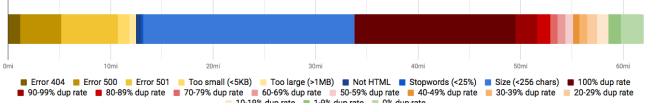
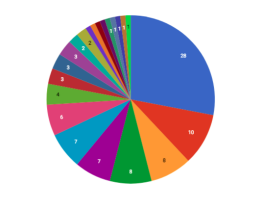
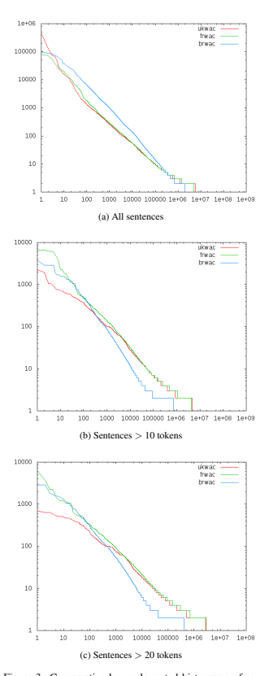

See discussions, stats, and author profiles for this publication at: https://www.researchgate.net/publication/326303825

# The Brwac Corpus: A New Open Resource For Brazilian Portuguese

Conference Paper · May 2018 CITATIONS
86 READS
7,642 4 authors:

Jorge Wagner Universidade Federal do Rio Grande do Sul 21 PUBLICATIONS   399 CITATIONS   
SEE PROFILE
Marco Idiart

 Universidade Federal do Rio Grande do Sul 64 PUBLICATIONS   **3,357** CITATIONS   
SEE PROFILE
Rodrigo Souza Wilkens

 Université Catholique de Louvain - UCLouvain 37 PUBLICATIONS   192 CITATIONS   
SEE PROFILE
Aline Villavicencio

 Universidade Federal do Rio Grande do Sul 148 PUBLICATIONS   **1,797** CITATIONS   
SEE PROFILE
The user has requested enhancement of the downloaded file.

# The Brwac Corpus: A New Open Resource For Brazilian Portuguese

## Jorge A. Wagner Filho1, Rodrigo Wilkens2, Marco Idiart3, Aline Villavicencio1,4 1Institute Of Informatics, Federal University Of Rio Grande Do Sul, Brazil

2 CENTAL, Universite catholique de Louvain - UCL ´
3Institute of Physics, Federal University of Rio Grande do Sul, Brazil 4 School of Computer Science and Electronic Engineering, University of Essex, UK
jawfilho@inf.ufrgs.br, rodrigo.wilkens@uclouvain.be, marco.idiart@gmail.com, avillavicencio@inf.ufrgs.br

## Abstract

In this work, we present the construction process of a large Web corpus for Brazilian Portuguese, aiming to achieve a size comparable to the state of the art in other languages. We also discuss our updated sentence-level approach for the strict removal of duplicated content. Following the pipeline methodology, more than 60 million pages were crawled and filtered, with 3.5 million being selected.

The obtained multi-domain corpus, named *brWaC*, is composed by 2.7 billion tokens, and has been annotated with tagging and parsing information. The incidence of non-unique long sentences, an indication of replicated content, which reaches 9% in other Web corpora, was reduced to only 0.5%. Domain diversity was also maximized, with 120,000 different websites contributing content. We are making our new resource freely available for the research community, both for querying and downloading, in the expectation of aiding in new advances for the processing of Brazilian Portuguese. Keywords: Web as Corpus, large corpus, Brazilian Portuguese

## 1. Introduction

In recent years, initiatives for the construction of large corpora have attained ever-growing interest in the NLP community. They are especially relevant for applications which demand large volumes of data, such as neural methods (Pennington et al., 2014; Bahdanau et al., 2014; Johnson et al., 2016), and also tend to produce more reliable resources for statistical models. In this paper, we build on previous work (Wagner Filho et al., 2016) and aim to construct a large and freely available Web corpus for Brazilian Portuguese, compatible with the state of the art in other languages. An example of the need for new, large corpora in this language was shown by Rodrigues et al. (2016),
who had to combine 19 different corpora to obtain a 1.7 billion tokens corpus and create a distributional semantics model comparable to those available for English. Besides language models, the corpus presented here can also be used, for example, in dictionary creation (Kilgarriff et al.,
2008), word similarity (Levy et al., 2015) and word sense induction (Navigli and Velardi, 2010; Di Marco and Navigli, 2013).

A widely adopted approach for the construction of large corpora is the WaCky (*Web-As-Corpus Kool Yinitiative*)
methodology (Bernardini et al., 2006; Baroni et al., 2009),
which has been used to provide corpora in the scale of billions of tokens for multiple languages, extracting text content from the Web. It also enables the construction of corpora without domain biases, considering that a corpus will automatically get balanced after reaching a substantial size
(Xiao, 2010).

When constructing these corpora a real concern is to gather as representative and diverse material from a domain as possible. Indeed, the *WaCky* pipeline incorporates strategies to avoid duplicated material in the resulting corpus. A
widely adopted approach involves adopting a threshold for the number of overlapping n-grams randomly sampled between each pair of documents (Broder, 1997). However, the results depend on the accuracy and coverage of the sampling procedure in each of the documents, so that larger samples are more likely to produce more reliable indication of redundancy. On the other hand, comparing each two documents is a costly and time-consuming task, especially as the number of documents grows. Therefore, it is important to find a balance between the scale of redundancy detection comparisons and the degree of redundancy that is acceptable in the resulting corpus. In this paper, we analyse the amount of redundancy in existing WaC corpora and provide a quantitative analysis of corpus size as a function of redundancy. We also propose an approach for removing duplicated content taking into account a balance between corpus size (and the computational costs of tracking duplication) and content diversity.

In this work, we start with a discussion of resources created from the web (Section 2). In particular for Brazilian Portuguese, we describe how starting with a 1.6 billion token corpus (Wagner Filho et al., 2016) and following a strict methodology (Section 3), the resulting corpus is expanded to encompass 2.7 billion tokens. This result is discussed in terms of corpus size, domain diversity and content originality (Section 4). Final remarks are presented in Section 5. The resulting language resource, named *brWaC*,
is freely available for research purposes, both for querying and downloading1.

## 2. Related Work

With growing content availability in the Web, it became natural for researchers to look at it as a source to complement their traditional text repositories. Among notable examples to adopt this idea are the Terabyte corpus (Clarke et al., 2002) (53bi tokens) and the Web Text corpus (Liu and Curran, 2006) (10bi tokens). Nonetheless, these early resources often included large amounts of material that is of limited relevance (such as computer code) and duplicated materials. Moreover, content quality was not controlled. Recently, therefore, the focus in Web corpora construction shifted, from downloading large volumes of text to attaining corpus quality trough efficient post processing.

In this context, the WaCky (*Web-As-Corpus Kool Yinitiative*) methodology was proposed (Bernardini et al., 2006; Baroni et al., 2009). It includes four steps: (1) identification of seed URLs; (2) post-crawl cleaning; (3) removal of duplicated content; and (4) annotation. These are discussed in the next section.

Initially, four large corpora were created, targeting English, German, Italian (Baroni et al., 2009) and French (Ferraresi et al., 2010). In previous work, we have already explored this methodology to propose an initial version of the resource presented here, *brWaC*, targeting Brazilian Portuguese (Wagner Filho et al., 2016). We achieved a 1.5bi tokens version, which was also automatically classified in different readability levels. Initial efforts in this direction had already been implemented before (Boos et al., 2014), but a posterior rigorous processing of the collected content resulted in a small corpus with only 200mi tokens.

The *TenTen* Corpus Family (Jakub´ıcek et al., 2013) is an ˇ
initiative by Sketch Engine (Kilgarriff et al., 2004) to construct Web corpora for all major world languages. Currently, corpora for 31 different languages are available, including a 4 billion tokens corpus for Portuguese (*ptTenTen*).

However, this corpus is not openly available, a key aspect of our research motivation. Moreover, it includes content from both the European and Brazilian variants of Portuguese, not being directly comparable to our proposal. Focusing on characteristics of the written language, while there is a large core that is shared among different Portuguese variants, there are also lexical and syntactic characteristics of Brazilian Portuguese that are marked in comparison to the others (Branco and Costa, 2007). For instance, comparing these two variants, there is a strong difference in the preference for the use of clitics. Subsequent analyses that use these corpora or models constructed from them may result in an amalgamation of different variants that does not reflect accurately the characteristics of any particular variant.

This may create problems for downstream applications, like text simplification, for which the simplicity and naturalness of a text are linked to the language usage for that particular community of speakers. With this work we aim to produce a large corpus that targets Brazilian Portuguese.

## 3. Methodology

Here, we follow the four-step pipeline approach from the WaC methodology (Bernardini et al., 2006). Our implementation was based on the *Web as Corpus Toolkit*2(Ziai and Ott, 2005), an open source, modular and expansible toolkit which fitted our purposes well. New documents were collected and merged with our previous 1.5 billion corpus, following the steps in Sections 3.1 to 3.4.

## 3.1. Urls Identification

Initially, a set of URLs is identified, employing queries to a search engine with random pairs of content words. The ten first results for each query are collected and expanded through a two-level recursion of the included links. Only
.br top-level domain pages are considered, since we are targeting Brazilian Portuguese. Although this filter cannot completely ensure that documents from other variants are not occasionally included, it maximizes language homogeneity.

In this new collection, 8000 pairs of medium-frequency words from the Linguateca repository (Santos et al., 2004)
were used. These resulted in 80k initial seeds obtained from the Microsoft Bing engine API. The final set, after link expansion, contained more than 38 million URLs.

## 3.2. Post-Crawl Cleaning

In a second moment, documents are filtered according to a series of criteria, such as size, and cleaned by filters of non-target content (e.g. HTML code, headers, footers and advertisement - also known as *boilerplate*). The density of stopwords and HTML tags is also controlled to ensure document quality (Pomikalek, 2013). A high minimum thresh- ´
old of stopwords (25%) also ensures that selected documents are indeed in the targeted language.

## 3.3. Removal Of Duplicated Content

In the third step of the pipeline, documents with intersection of content are detected and removed trough the pairwise comparison of all documents. The algorithm from Kilgarriff et al. (2006) was used. A global set of sentences is kept, and documents are processed linearly, counting large sentences (with more than 25 characters) which have already been seen previously. The percentage of these nonoriginal sentences in a given document is then compared to a predefined maximum threshold. After empirical testing of different thresholds, we chose to tolerate a maximum of 10% of non-original large sentences, in order to maximize corpus quality.

We also modified this algorithm in order to filter sentences and include them in the global set immediately, rather than after the analysis of the whole document. This way, documents with high levels of intra-document duplication (e.g.

pages from discussion lists) can also be detected and removed.

## 3.4. Annotation

Finally, all documents were annotated with syntactic information. To this end, the Palavras parser was used (Bick, 2000). The resultant annotated corpus was made available in both CoNLL and Moses formats.

## 4. Results

In this section, the obtained corpus is evaluated with relation to our three main requirements. Corpus size is comparable to those in other languages (Section 4.1), and domain biases should not be present (Section 4.2). Finally, duplicated content should be minimized (Section 4.3).

Figure 1: Documents filtered out in different steps of the pipeline. Strict rules resulted in only 5.6% of the original seeds

being selected. The most common reasons for discarding were exact duplicates and small size after *boilerplate* removal.

| Part of speech   | % of tokens   | % of types   |
|------------------|---------------|--------------|
| Noun             | 26.38         | 69.652       |
| Determiner       | 18.51         | 0.014        |
| Preposition      | 17.71         | 0.005        |
| Verb             | 15.55         | 13.048       |
| Adjective        | 6.89          | 16.469       |
| Conjunction      | 5.16          | 0.001        |
| Adverb           | 5.01          | 0.668        |
| Personal pronoun | 2.14          | 0.007        |
| Specifier        | 1.83          | 0.002        |
| Numeral          | 0.63          | 0.019        |
| Interjection     | 0.05          | 0.006        |

Table 1: Frequency of different parts of speech, in percentage of tokens and types, as annotated by the Palavras parser.

## 4.1. Corpus Size

Around 95% of all documents initially crawled were discarded as a result of the strict set of filters, as shown in Figure 1. The main reasons were the existence of exact duplicates (100% content duplication rate) and content size smaller than 256 characters - this filter is applied after the boilerplate removal by the *jusText* component (Pomikalek, ´
2013). The large occurrence of duplicates is an expected consequence of the link recursion in the first step of the pipeline, which results in many similar seeds inside the same page domain. A detailed analysis on the presence of duplicated content in the final corpus is presented in Section 4.3.

Our collection process resulted in a corpus with 2.68 billion tokens (a 72% increase in relation to the previous version)
and 5.79 million types, distributed in 145 million sentences and 3.53 million documents. These counts strictly exclude any tokens with numbers or special characters (except hyphens). Table 1 presents the frequency distribution of different parts of speech as annotated by the Palavras parser3, also considering this restriction. Table 2, on the other hand, presents a comparison between brWaC and other corpora: *frWaC* and *ukWaC*, which also follow the WaCky methodology, and *CETENFolha*4, another corpus of Brazilian Portuguese. We can observe that brWaC is considerably larger than a typical corpus, such as CETENFolha, as expected, and is also larger amongst WaC

| Corpus     | #Documents   | #Tokens   | #Types   |
|------------|--------------|-----------|----------|
| frWaC      | 2.20mi       | 1.02bi    | 3.9mi    |
| ukWaC      | 2.69mi       | 1.91bi    | 3.8mi    |
| brWaC      | 3.53mi       | 2.68bi    | 5.8mi    |
| CETENFolha | 340k         | 33mi      | 357k     |

Table 2: Size comparison with reference corpora. *brWaC* is considerably larger than a typical corpus, such as *CETENFolha*, and is also larger amongst other WaC corpora.

## Corpora. 4.2. Domain Diversity

The list of a hundred websites which contributed the highest number of documents to the corpus was annotated with the WebShrinker Website Categorization API5 using the IAB taxonomy6. Results are shown in Figure 2. An analysis of the different content categories present indicate that the corpus was successful in fulfilling the prerequisite of being independent of domain. Another interesting observation was the relatively small number of occurrences of each of these pages. The most frequent website in the list contributed 70,348 documents, while the whole corpus includes 3.53 million. Moreover, in total, 121,075 websites are represented. This indicates that, as a result of the strict anti-duplication rules, website diversity was also maximized.

## 4.3. Content Originality

In order to evaluate the efficiency of our approach for the removal of duplicated content (Section 3.3), we compared brWaC to two reference WaC corpora, *ukWaC* and *frWaC*,
in terms of the occurrence of repeated sentences.

We found that, despite including considerably more sentences, our stricter approach resulted in smaller numbers of repeated sentences, especially of large size, in the *brWaC*
corpus (see Table 3). While 6.3% and 9.3% of all sentences appear more than once in the British and French WaCs, respectively, in *brWaC* only 1.3% are repeated. When we consider only sentences longer than 20 tokens, the difference is even larger: 5.7% of non-unique sentences for ukWaC, 9% for *frWaC*, and 0.5% for *brWaC*. The log-scale sorted histograms in Figure 3 present a more detailed analysis of the repeated sentences. When considering all of them, Figure 2: Annotated categories of the 100 most frequent

websites in *brWaC* (legend is presented in descending order). Great diversity of content categories and relatively small number of occurrences of the most common pages indicate the fulfilment of our prerequisite of a corpus independent of domain. the average number of occurrences of each non-unique sentence in *brWaC* is slightly higher. Nonetheless, considering only large sentences (with more than 10 or 20 tokens each),
which are an indicative of replicated content, average repetitions in *brWaC*, after the top thousand, are consistently lower.

Note that *ukWaC* and *frWaC* adopted the quadratic approach of comparison between pairs of documents, while brWaC adopts the linear approach of inspection of nonoriginal long sentences in a document. We believe these results demonstrate that this alternative offers a better costbenefit at this task.

## 5. Conclusion

In this work, we presented the construction process of a large Web corpus, aiming to place Brazilian Portuguese on the same level as other major languages. Following the *WaCky* methodology, we constructed the *brWaC* corpus with 145 million sentences and 2.7 billion tokens. This new resource is freely available for both querying (through a NoSketch Engine interface) and downloading in CoNLL
and Moses formats. Our hope is that a resource of this magnitude may form the basis and enable further studies targeting Brazilian Portuguese. We also provided an in-depth analysis of redundancy and corpus diversity, proposing the tolerance of 10% of non-original long sentences in a document as a good balance between originality of material and cost of collecting and processing documents. As future work, we highlight the need for more detailed analysis of the quality of this new corpus, including comparative studies with other reference corpora, obtained from different sources. We also plan on using it as the basis for creating and training vector space models.

| ukWaC      | frWaC   | brWaC   |       |
|------------|---------|---------|-------|
| Total      | 88.2    | 54.8    | 145.3 |
| >10 tokens | 74.9    | 45.8    | 115.4 |
| >20 tokens | 48.5    | 31.1    | 77.5  |
| Total      | 75.9    | 43.2    | 132.0 |
| >10 tokens | 67.6    | 38.2    | 114.1 |
| >20 tokens | 44.2    | 26.3    | 76.8  |
| Total      | 5.6     | 5.1     | 2.0   |
| >10 tokens | 4.6     | 4.2     | 0.7   |
| >20 tokens | 2.8     | 2.8     | 0.4   |

Table 3: Comparative analysis on the incidence of unique and repeated sentences (in millions) across different Web corpora. Despite including considerably more sentences, our stricter approach to duplicated content resulted in smaller numbers of repeated sentences, especially of large size, in the *brWaC* corpus.

## Acknowledgements

The authors acknowledge the partial funding of this research by CNPq-Brazil (grants n. 400715/2014-7, 312114/2015-0 and 423843/2016-8) and the Walloon Region (Project BEWARE n. 1610378).

6. References Bahdanau, D., Cho, K., and Bengio, Y. (2014). Neural machine translation by jointly learning to align and translate. *arXiv preprint arXiv:1409.0473*.

Baroni, M., Bernardini, S., Ferraresi, A., and Zanchetta, E.

(2009). The wacky wide web: a collection of very large linguistically processed web-crawled corpora. *Language* resources and evaluation, 43(3):209–226.

Bernardini, S., Baroni, M., and Evert, S. (2006). A wacky introduction. *WaCky*, pages 9–40.

Bick, E. (2000). The parsing system" Palavras": Automatic grammatical analysis of Portuguese in a constraint grammar framework. Aarhus Universitetsforlag.

Boos, R., Prestes, K., Villavicencio, A., and Padro, M. ´
(2014). brwac: a wacky corpus for brazilian portuguese.

In *Computational Processing of the Portuguese Language*, pages 201–206. Springer.

Branco, A. and Costa, F. (2007). Self- or pre-tuning? deep linguistic processing of language variants. Workshop on Deep Linguistic Processing, ACL2007 - International Conference of the Association of Computational Linguistics, Prague, Czech Republic, 24-29 June 2007, pp.5764.

Broder, A. Z. (1997). On the resemblance and containment of documents. In *Compression and Complexity of* Sequences 1997. Proceedings, pages 21–29. IEEE.

Di Marco, A. and Navigli, R. (2013). Clustering and diversifying web search results with graph-based word sense induction. *Computational Linguistics*, 39(3):709–754.

Johnson, M., Schuster, M., Le, Q. V., Krikun, M., Wu, Y.,
Chen, Z., Thorat, N., Viegas, F., Wattenberg, M., Cor- ´
rado, G., et al. (2016). Google's multilingual neural machine translation system: Enabling zero-shot translation.

arXiv preprint arXiv:1611.04558.

Kilgarriff, A., Rychly, P., Smrz, P., and Tugwell, D. (2004).

Itri-04-08 the sketch engine. *Information Technology*,
105:116.

Kilgarriff, A., Rundell, M., and Dhonnchadha, E. U.

(2006). Efficient corpus development for lexicography:
building the new corpus for ireland. *Language Resources and Evaluation*, 40(2):127–152.

Kilgarriff, A., Husak, M., McAdam, K., Rundell, M., and ´
Rychly, P. (2008). Gdex: Automatically finding good `
dictionary examples in a corpus. In *Proc. Euralex*.

Levy, O., Goldberg, Y., and Dagan, I. (2015). Improving distributional similarity with lessons learned from word embeddings. *Transactions of the Association for Computational Linguistics*, 3:211–225.

Navigli, R. and Velardi, P. (2010). Learning word-class lattices for definition and hypernym extraction. In *Proceedings of the 48th Annual Meeting of the Association* for Computational Linguistics, pages 1318–1327. Association for Computational Linguistics.

Pennington, J., Socher, R., and Manning, C. D. (2014).

Glove: Global vectors for word representation. In *Proceedings of the 2014 Conference on Empirical Methods* on Natural Language Processing (EMNLP), volume 14, pages 1532–1543.

Pomikalek, J. (2013). justext: Heuristic based boiler- ´
plate removal tool. *Available: Google code, online* http://code. google. com/p/justext.

Rodrigues, J., Branco, A., Neale, S., and Silva, J. (2016).

Lx-dsemvectors: Distributional semantics models for portuguese. In *International Conference on Computational Processing of the Portuguese Language*, pages 259–270. Springer.

Wagner Filho, J., Wilkens, R., Zilio, L., Idiart, M., and Villavicencio, A. (2016). Crawling by readability level.

In *Proceedings of 12th International Conference on the* Computational Processing of Portuguese (PROPOR),
pages 306–318.

Xiao, R. (2010). Corpus creation. In *Handbook of Natural* Language Processing (2n Revised edition), pages 147–
165. CRC Press - Taylor & Francis Group.

Ziai, R. and Ott, N. (2005). Web as corpus toolkit: User's and hacker's manual. *Lexical Computing Ltd., Brighton,*
UK.

## 7. Language Resource References

Baroni, M., Bernardini, S., Ferraresi, A., and Zanchetta, E.

(2009). The wacky wide web: a collection of very large linguistically processed web-crawled corpora. *Language* resources and evaluation, 43(3):209–226.

Clarke, C. L., Cormack, G. V., Laszlo, M., Lynam, T. R.,
and Terra, E. L. (2002). The impact of corpus size on question answering performance. In Proceedings of the 25th Annual International ACM SIGIR Conference on Research and Development in Information Retrieval, pages 369–370. ACM.

Ferraresi, A., Bernardini, S., Picci, G., and Baroni, M.

(2010). Web corpora for bilingual lexicography: a pilot study of english/french collocation extraction and translation. Using Corpora in Contrastive and Transla-
tion Studies. Newcastle: Cambridge Scholars Publishing, pages 337–362.

Jakub´ıcek, M., Kilgarriff, A., Kov ˇ a´ˇr, V., Rychly, P., and `
Suchomel, V. (2013). The tenten corpus family. In 7th International Corpus Linguistics Conference (CL), pages 125–127.

Liu, V. and Curran, J. R. (2006). Web text corpus for natural language processing. In *European Chapter of the* Association for Computational Linguistics (EACL).

Santos, D., Simoes, A., Frankenberg-Garcia, A., Pinto, A., ˜
Barreiro, A., Maia, B., Mota, C., Oliveira, D., Bick, E., Ranchhod, E., et al. (2004). Linguateca: um centro de recursos distribu´ıdo para o processamento computacional da l´ıngua portuguesa.

Wagner Filho, J. A., Wilkens, R., and Villavicencio, A.

(2016). Automatic construction of large readability corpora. *Workshop on Computational Linguistics for Linguistic Complexity (CL4LC)*, pages 164–173.