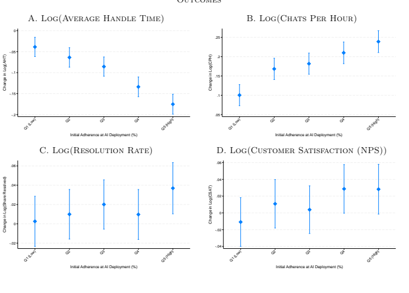

GENERATIVE AI AT WORK
Erik Brynjolfsson Danielle Li Lindsey R. Raymond Working Paper 31161 http://www.nber.org/papers/w31161 NATIONAL BUREAU OF ECONOMIC RESEARCH
1050 Massachusetts Avenue Cambridge, MA 02138 April 2023, revised November 2023 We are grateful to Daron Acemoglu, David Autor, Amittai Axelrod, Eleanor Dillon, Zayd Enam, Luis Garicano, Alex Frankel, Sam Manning, Sendhil Mullainathan, Emma Pierson, Scott Stern, Ashesh Rambachan, John Van Reenen, Raffaella Sadun, Kathryn Shaw, Christopher Stanton, Sebastian Thrun, and various seminar participants for helpful comments and suggestions. We thank Max Feng for providing excellent research assistance and the Stanford Digital Economy Lab for funding. The content is solely the responsibility of the authors and does not necessarily represent the official views of Stanford University, MIT, or the National Bureau of Economic Research. At least one co-author has disclosed additional relationships of potential relevance for this research. Further information is available online at http://www.nber.org/papers/w31161 NBER working papers are circulated for discussion and comment purposes. They have not been peer-reviewed or been subject to the review by the NBER Board of Directors that accompanies official NBER publications. © 2023 by Erik Brynjolfsson, Danielle Li, and Lindsey R. Raymond. All rights reserved. Short sections of text, not to exceed two paragraphs, may be quoted without explicit permission provided that full credit, including © notice, is given to the source. Generative AI at Work Erik Brynjolfsson, Danielle Li, and Lindsey R. Raymond NBER Working Paper No. 31161 April 2023, revised November 2023 JEL No. D8,J24,M15,M51,O33

## Abstract

New AI tools have the potential to change the way workers perform and learn, but little is known about their impacts on the job. In this paper, we study the staggered introduction of a generative AI-based conversational assistant using data from 5,179 customer support agents. Access to the tool increases productivity, as measured by issues resolved per hour, by 14% on average, including a 34% improvement for novice and low-skilled workers but with minimal impact on experienced and highly skilled workers. We provide suggestive evidence that the AI model disseminates the best practices of more able workers and helps newer workers move down the experience curve. In addition, we find that AI assistance improves customer sentiment, increases employee retention, and may lead to worker learning. Our results suggest that access to generative AI can increase productivity, with large heterogeneity in effects across workers.

| Erik Brynjolfsson Stanford Digital Economy Laboratory 353 Jane Stanford Way, Office 136 Stanford, CA 94305 and NBER erik.brynjolfsson@gmail.com   |
|---------------------------------------------------------------------------------------------------------------------------------------------------|

| Lindsey R. Raymond MIT Sloan School of Management 100 Main Street E62-489 Cambridge, MA 02142 lindsey.r.raymond@gmail.com   |
|-----------------------------------------------------------------------------------------------------------------------------|

| MIT Sloan School of Management 100 Main St, E62-484 Cambridge, MA 02142 and NBER d_li@mit.edu   |
|-------------------------------------------------------------------------------------------------|

The emergence of generative artificial intelligence (AI) has attracted significant attention, but few studies have examined its economic impact. While various generative AI tools have performed well in laboratory settings, excitement about their potential has been tempered by concerns that these tools may be less effective in real-world settings, where they may encounter unfamiliar problems, face organizational resistance, or provide misleading information in a consequential environment (Peng et al., 2023a; Roose, 2023).

In this paper, we study the adoption of a generative AI tool that provides conversational guidance for customer support agents.1 This is, to our knowledge, the first study of the impact of generative AI when deployed at scale in the workplace. We find that access to AI assistance increases the productivity of agents by 14%, as measured by the number of customer issues they are able to resolve per hour. In contrast to studies of prior waves of computerization, we find that these gains accrue disproportionately to less-experienced and lower-skill workers.2 We argue that this occurs because generative AI systems work by capturing and disseminating the patterns of behavior that characterize the most productive agents, including knowledge that has eluded automation from earlier waves of computerization.

Computers and software have transformed the economy with their ability to perform certain tasks with far more precision, speed, and consistency than humans. To be effective, these systems typically require explicit and detailed instructions for how to transform inputs into outputs: when engineers write code to perform a task, they are codifying that task.3 Yet because many workplace activities—such as writing emails, analyzing data, or creating presentations—rely on tacit knowledge, they have so far defied automation (Polanyi, 1966; Autor, 2014).4 Machine learning (ML) algorithms work differently from traditional computer programs: instead of requiring explicit instructions to function, these systems infer instructions from examples. Given a training set of images, for instance, ML systems can learn to recognize specific individuals even though one cannot fully explain what physical features characterize a given person's identity. This ability highlights a key, distinguishing aspect of ML systems: they can learn to perform tasks even 1 when no instructions exist—including tasks requiring tacit knowledge that could previously only be gained through lived experience (Polanyi, 1966; Autor, 2014; Brynjolfsson and Mitchell, 2017).5 In addition, ML systems are often trained on data from human workers, who naturally differ in their abilities. By seeing many examples of tasks—making sales pitches, driving a truck, or diagnosing a patient, to name a few—performed well and poorly, these models can implicitly learn what specific behaviors and characteristics set high-performing workers apart from their less effective counterparts. That is, not only are generative AI models capable of performing complex tasks, they might also be capable of capturing the skills that distinguish top workers. The use of ML tools may therefore expose lower-skill workers to new skills and lead to differential changes in productivity.

We study the impact of generative AI on productivity and worker experience in the customer service sector, an industry with one of the highest rates of AI adoption (Chui et al., 2021). We examine the staggered deployment of a chat assistant using data from 5,000 agents working for a Fortune 500 software firm that provides business process software. The tool we study is built on a recent version of the Generative Pre-trained Transformer (GPT) family of large language models developed by OpenAI (OpenAI, 2023). It monitors customer chats and provides agents with realtime suggestions for how to respond. It is designed to augment agents, who remain responsible for the conversation and are free to ignore its suggestions.

We have three sets of findings.

First, AI assistance increases worker productivity, resulting in a 14% increase in the number of chats that an agent successfully resolves per hour. This increase reflects shifts in three components of productivity: a decline in the time it takes an agent to handle an individual chat, an increase in the number of chats that an agent handles per hour (agents may handle multiple chats at once), and a small increase in the share of chats that are successfully resolved. The productivity impacts of AI assistance are highly uneven. We find that less-skilled and less-experienced workers improve significantly across all productivity measures we consider, including a 34% increase in the number of issues they are able to resolve per hour. Access to the AI tool helps newer agents move more quickly down the experience curve: treated agents with two months of tenure perform just as well as untreated agents with more than six months of tenure. In contrast, we find minimal impacts on the productivity of more-experienced or more-skilled workers. Indeed, we find evidence that AI assistance may decrease the quality of conversations by the most skilled agents. These results contrast, in spirit, with studies that find evidence of skill-biased technical change for earlier waves of computer technology (Autor et al., 2003; Acemoglu and Restrepo, 2018; Bresnahan et al., 2002; Bartel et al., 2007).

Our second set of results investigates the mechanism underlying our main findings. We show that AI recommendations appear useful to workers: agents who follow recommendations more closely see larger gains in productivity, and adherence rates increase over time for all workers, particularly those who were initially more skeptical. We also find that engagement with AI recommendations can generate durable learning. Using data on software outages—periods in which the AI software fails to provide any suggestions—we show that workers see productivity gains relative to their pre-AI baseline even when recommendations are unavailable. These outage-period gains are more pronounced for workers who had more prior exposure to AI assistance or who had followed AI recommendations more closely. Finally, we analyze the text of agents' chats and provide suggestive evidence that access to AI drives convergence in communication patterns: low-skill agents begin communicating more like high-skill agents.

Our third set of results focus on agents' experience of work. Work in contact centers6is often difficult. Agents are regularly exposed to hostile treatment from upset (and anonymous) customers, and because much work is outsourced, many agents work overnight shifts in order to service US business hours. AI assistance may help agents communicate more effectively but could also increase the likelihood that agents are perceived as mechanical or inauthentic. We show that access to AI
assistance markedly improves how customers treat agents, as measured by the sentiment of their chat messages. We also find that customers are less likely to question the competence of agents by requesting to speak to a supervisor. These changes come alongside a substantial decrease in worker attrition, which is driven by the retention of newer workers.

Our overall findings show that access to generative AI can increase the productivity and retention of individual workers. We emphasize, however, that our paper is not designed to shed light on the aggregate employment or wage effects of generative AI tools. Firms may respond to increasing productivity among novice workers by hiring more of them, de-skilling positions, or seeking to develop more powerful AI systems that can replace lower-skill workers entirely. Unfortunately, our data do not allow us to observe changes in wages, overall labor demand, or the skill composition of workers hired for the job.

Our results also highlight the longer-term incentive challenges that AI systems bring. Top workers are generally not paid for their contributions to the training data that AI systems use to capture and disseminate their skills. Yet, without these contributions, AI systems may be less 6The term "contact center" updates the term "call center," to reflect the fact that a growing proportion of customer service contacts no longer involve phone calls.

effective in learning to resolve new problems. Our work therefore raises questions about how workers should be compensated for the data they provide to AI systems.

Our paper is related to a large literature on the impact of technological adoption on worker productivity and the organization of work (e.g. Rosen, 1981; Autor et al., 1998; Athey and Stern, 2002; Bresnahan et al., 2002; Bartel et al., 2007; Acemoglu et al., 2007; Hoffman et al., 2017; Bloom et al., 2014; Michaels et al., 2014; Garicano and Rossi-Hansberg, 2015; Acemoglu and Restrepo, 2020; Felten et al., 2023). Many of these studies, particularly those focused on information technologies, find evidence that IT complements higher-skill workers (Akerman et al., 2015; Taniguchi and Yamada, 2022). Bartel et al. (2007) shows that firms that adopt IT tend to use more skilled labor and increase skill requirements for their workers. Acemoglu and Restrepo (2020) study the diffusion of robots and find that the negative employment effects of robots are most pronounced for workers in blue collar occupations and those with less than a college education.

There have been substantially fewer studies involving AI-based technologies, generative or not.

Acemoglu et al. (2022); Zolas et al. (2020); Calvino and Fontanelli (2023) examine economy-wide data from the US and OECD and show that the adoption of AI tools is concentrated among large, young firms with relatively high productivity. So far, evidence on the productivity impacts of these technologies is mixed: for example, Acemoglu et al. (2022) finds no detectable relationship between investments in AI-specific tools, while Babina et al. (2022) finds evidence of a positive relationship between firms' AI investments and their subsequent growth and valuations.7 These studies all caution that the productivity effects of AI technologies may be challenging to identify at the macro-level because AI-adopting firms differ substantially from non-adopters.

In this paper, we provide micro-level evidence on the adoption of a generative AI tool across thousands of workers working at a given firm and its subcontractors. Our work is more closely related to several other studies examining the impacts of generative AI in lab-like settings. Peng et al. (2023b) recruit software engineers for a specific coding task (writing an HTTP server in JavaScript) and show that those given access to GitHub Copilot complete this task twice as quickly.

Similarly, Noy and Zhang (2023) conduct an online experiment showing that subjects given access to ChatGPT complete professional writing tasks more quickly. Choi and Schwarcz (2023) give law students access to AI assistance on a law school exam. Consistent with our findings, Noy and Zhang (2023), Choi and Schwarcz (2023) and Peng et al. (2023a) find that ChatGPT compresses the productivity distribution, with lower-skill workers benefiting the most. Our paper, however, is the first to examine longer-term effects in a real-world workplace where we can also track patterns of learning, customer-side effects and changes in the experience of work.

## 1 Generative Ai And Large Language Models

In recent years, the rapid pace of AI development and public release tools such as ChatGPT,
GitHub Copilot, and DALL-E have attracted widespread attention, optimism, and alarm (The White House, 2022). These technologies are all examples of "generative AI," a class of machine learning technologies that can generate new content—such as text, images, music, or video—by analyzing patterns in existing data. In this section, we provide background on generative AI as a technology and discuss its potential economic implications.

## 1.1 Technical Primer

This paper focuses on an important class of generative AI, large language models (LLMs). LLMs are neural network models designed to process sequential data (Bubeck et al., 2023). An LLM is trained by learning to predict the next word in a sequence, given what has come before, using a large corpus of text (such as Wikipedia, digitized books, or portions of the Internet). This knowledge of the statistical co-occurrence of words allows it to generate new text that is grammatically correct and semantically meaningful. Though "large language model" implies human language, the same techniques can be used to produce other forms of sequential data ("text") such as protein sequences, audio, computer code, or chess moves (Eloundou et al., 2023).

Recent progress in generative AI has been driven by four factors: computing scale, earlier innovations in model architecture, the ability to "pre-train" using large amounts of unlabeled data and refinements in training techniques.8 First, the quality of LLMs is strongly dependent on scale: the amount of computing power used for training, the number of model parameters, and dataset size (Kaplan et al., 2020). Firms are increasingly devoting more resources to increasing this scale. The GPT-3 model included 175 billion parameters, was trained on 300 billion tokens, and generated approximately $5 million dollars in computing costs alone; the GPT-4 model, meanwhile, is estimated to include 1.8 trillion parameters, trained on 13 trillion tokens, at a rumored computing-only cost of $ 65 million (Li, 2020; Brown et al., 2020; Patel and Wong, 2023)
8For a more detailed technical review of progress, see Radford and Narasimhan (2018); Radford et al. (2019); Liu et al. (2023); Ouyang et al. (2022).

In terms of model architecture, modern LLMs use two earlier key innovations: positional encoding and self-attention. Positional encodings keep track of the order in which a word occurs in a given input.9 Meanwhile, self-attention assigns importance weights to each word in the context of the entire input text. Together, this approach enables models to capture long-range semantic relationships within an input text, even when that text is broken up into smaller segments and processed in parallel (Vaswani et al., 2017; Bahdanau et al., 2015).

Next, LLMs can be pre-trained on large amounts of unlabeled data from sources such as Reddit or Wikipedia. Because unlabeled data is much more prevalent than labeled data, LLMs can learn about natural language on a much larger training corpus (Brown et al., 2020). By seeing, for instance, that the word "yellow" is more likely to be observed with "banana" or "sun" or "rubber duckie," the model can learn about semantic and grammatical relationships even without explicit guidance (Radford and Narasimhan, 2018). The resulting model can be used in multiple applications because its training is not specific to a particular set of tasks.

Finally, general-purpose LLMs can be further "fine-tuned" to generate output that matches the priorities of any specific setting (Ouyang et al., 2022; Liu et al., 2023). For example, a model trained to generate social media content would benefit from receiving labeled data that contain not just the content of a post or tweet, but also information on the amount of user engagement it received.

Similarly, an LLM may generate several potential responses to a given query, but some of them may be factually incorrect or contain toxic language. To discipline this model, human evaluators can rank these outputs to train a reward function that prioritizes desirable responses. These types of refinements can significantly improve model quality by making a general-purpose model better suited to its specific application (Ouyang et al., 2022).

Together, these innovations have generated meaningful improvements in model performance.

The Generative Pre-trained Transformer (GPT) family of models, in particular, has attracted considerable media attention for their rapidly expanding capabilities.10

## 1.2 The Economic Impacts Of Generative Ai

Computers have historically excelled at executing pre-programmed instructions, making them particularly effective at tasks that can be reduced to explicit rules (Autor, 2014). Consequently, computerization has disproportionately reduced demand for workers performing "routine" tasks such as data entry, bookkeeping, and assembly line work, reducing wages in these jobs (Acemoglu and Autor, 2011). At the same time, computerization has also increased the demand for workers who possess complementary skills such as programming, data analysis, and research. Together, these changes have contributed to increasing wage inequality in the United States and have been linked to a variety of organizational changes (Katz and Murphy, 1992; Autor et al., 2003; Michaels et al.,
2014; Bresnahan et al., 2002; Baker and Hubbard, 2003; OECD, 2023).

In contrast, generative AI tools do not require explicit instructions to perform tasks. If asked to write an email denying an employee a raise, generative AI tools will likely respond with a professional and conciliatory note. This occurs because the model will have seen many examples of workplace communication in which requests are declined in this manner. Importantly, the model produces such an output even though no programmer has explicitly specified what tone would be appropriate for what context, nor even defined what a tone like "professional" or "conciliatory" means. Indeed, the ability to behave "appropriately" is one that cannot be fully articulated even by those who possess it. Rather, people learn to do so from experience and apply unconscious rules in the process. This type of "tacit knowledge" underlies most tasks humans perform, both in and out of the workplace (Polanyi, 1966; Autor, 2014).

The fact that generative AI models display such skills suggests that they can acquire tacit knowledge that is embedded in the training examples they encounter. This ability expands the types of tasks that computers may be capable of performing to include non-routine tasks that rely on judgment and experience. For example, Github Copilot, an AI tool that generates code suggestions for programmers, has achieved impressive performance on technical coding questions and, if asked, can provide natural language explanations of how the code it produces works (Nguyen and Nadi, 2022; Zhao, 2023). Meanwhile, "AI-assistant" services such as Claude can be used to produce convincing business case analyses, including reading and interpreting financial statements and offering strategic assessments. Because many of these tasks—coding, financial analysis, etc.—
are currently performed by workers who have either been insulated or benefited from prior waves of technology adoption, the expansion of generative AI has the potential to shift the relationship between technology, labor productivity, and inequality (The White House, 2022).

Generative AI tools can not only expand the types of tasks that machines can perform, they may also reveal valuable information about how the most productive human workers differ from others. This is because the ML models underlying generative AI systems are commonly trained on data generated by human workers and, consequently, encounter many examples of people performing tasks both well and poorly. In learning to predict good outcomes on such data, ML models may implicitly identify characteristics or patterns of behavior that distinguish high and low performers, including subtleties rooted in tacit knowledge. Generative AI systems then take this knowledge and use it to produce new behaviors that embody what top performers might do. This ability could be 7 used in different ways: firms may choose to replace lower-skill workers with AI-based tools, such tools could be used to demonstrate best practices to help lower-skill workers improve or help less experienced workers get up to speed more quickly. In either case, generative AI tools may have differential impacts by worker ability, even amongst workers performing the same tasks.

Despite their potential, generative AI tools face significant challenges in real-world applications.

At a technical level, popular LLM-based tools, such as ChatGPT, have been shown to produce false or misleading information in unpredictable ways, generating concern about their ability to be reliable in high-stakes situations. Second, while LLM models often perform well on specific tasks in the lab (OpenAI, 2023; Peng et al., 2023b; Noy and Zhang, 2023), the types of problem that workers encounter in real-world settings are likely to be broader and less predictable. This raises concerns both about whether AI tools will be able to provide accurate assistance in every circumstance andperhaps more importantly—about whether workers will be able to distinguish cases where AI tools are effective from those where they are not. Finally, the efficacy of new technologies is likely to depend on how they interact with existing workplace structures. Promising technologies may have more limited effects in practice due to the need for complementary organizational investments, skill development, or business process redesign. Because generative AI technologies are only beginning to be used in the workplace, little is currently known about their impacts.

## 2 Our Setting: Llms For Customer Support 2.1 Customer Support And Generative Ai

We study the impact of generative AI in the customer service industry, an area with one of the highest surveyed rates of AI adoption.11 Customer support interactions are important for maintaining a company's reputation and building strong customer relationships, yet, as in many industries, there is substantial variation in worker productivity (Berg et al., 2018; Syverson, 2011).

Newer workers are also often less productive and require significant training. At the same time, turnover is high: industry estimates suggest that 60% of agents in contact centers leave each year, costing firms $10,000 to $20,000 dollars per agent (Buesing et al., 2020; Gretz and Jacobson, 2018).

To address these workforce challenges, the average supervisor spends at least 20 hours per week coaching agents with lower performance (Berg et al., 2018). Faced with variable productivity, high turnover, and high training costs, firms are increasingly turning to AI tools (Chui et al., 2021).

11For instance, of the businesses that report using AI, 22% use AI in their customer service centers (Chui et al.,
2021).

At a technical level, customer support is well-suited for current generative AI tools. From an AI's perspective, customer-agent conversations can be thought of as a series of pattern-matching problems in which one is looking for an optimal sequence of actions. When confronted with an issue such as "I can't login," an AI/agent must identify which types of underlying problems are most likely to lead a customer to be unable to log in and think about which solutions typically resolve these problems ("Can you check that caps lock is not on?"). At the same time, they must be attuned to a customer's emotional response, making sure to use language that increases the likelihood that a customer will respond positively ("that wasn't stupid of you at all! I always forget to check that too!"). Because customer service conversations are widely recorded and digitized, pre-trained LLMs can be fine-tuned for customer service using many examples of both successfully and unsuccessfully resolved conversations.

Customer service is also a setting where there is high variability in the abilities of individual agents. For example, top-performing agents are often more effective at diagnosing the underlying technical issue given a customer's problem description. These workers often ask more questions before settling on a diagnosis of the problem; this takes longer initially, but reduces the likelihood that agents waste time trying to resolve the wrong problem. Such differences in agent behavior can often be inferred from the large amounts of training data that customer-service-specific AI models have access to. As a result, customer service is also a setting in which generative AI models can potentially encode some of the "best practices" that top-performing agents use.

In the remainder of this section, we provide details about the firm we study and the AI tool they adopt.

## 2.2 Data Firm Background

We work with a company that provides AI-based customer service support software (hereafter, the "AI firm") to study the deployment of their tool at one of their client firms, (hereafter, the "data firm").

Our data firm is a Fortune 500 enterprise software company that specializes in business process software for small and medium-sized businesses in the United States. It employs a variety of chat-based technical support agents, both directly and through third-party firms. The majority of agents in our sample work from offices located in the Philippines, with a smaller group working in the United States and in other countries. Across locations, agents are engaged in a fairly uniform job: answering technical support questions from US-based small business owners.

Chats are randomly assigned, and support sessions are relatively lengthy, averaging 40 minutes, with much of the conversation spent trying to diagnose the underlying technical problem. The job requires a combination of detailed product knowledge, problem solving skills, and the ability to deal with frustrated customers.

Our firm measures productivity using three metrics that are standard in the customer service industry: "average handle time," the average time an agent takes to finish a chat; "resolution rate," the share of conversations that the agent successfully resolves; and "net promoter score," (customer satisfaction), which is calculated by randomly surveying customers after a chat and calculating the percentage of customers who would recommend an agent minus the percentage who would not. A productive agent is able to field customer chats quickly while maintaining a high resolution rate and net promoter score.

Across locations, agents are organized into teams with a manager who provides feedback and training to agents. Once a week, managers hold one-on-one feedback sessions with each agent. For example, a manager might share the solution to a new software bug, explain the implication of a tax change, or suggest how to better manage customer frustration with technical issues. Agents work individually, and the quality of their output does not directly affect others. Agents are paid an hourly wage and bonuses based on their performance relative to other agents.

## 2.3 Ai System Design

The AI system we study combines a recent version of GPT with additional ML algorithms specifically fine-tuned to focus on customer service interactions. The system is further trained on a large set of customer-agent conversations that have been labeled with a variety of outcomes and characteristics: whether the call was successfully resolved, how long it took to handle the call, and whether the agent in charge of the call is considered a "top" performer by the data firm. The AI firm then uses these data to look for conversational patterns that are most predictive of call resolution and handle time.

The AI firm further trains its model using a process similar in spirit to Ouyang et al. (2022) to prioritize agent responses that express empathy, provide appropriate technical documentation, and limit unprofessional language. This additional training mitigates some of the concerns associated with relying on LLMs to generate text.

Once deployed, the AI system generates two main types of output: 1) real-time suggestions for how agents should respond to customers and 2) links to the data firm's internal documentation for relevant technical issues. In both cases, recommendations are based on a history of the conversation.12 Figure 1 illustrates an example of AI assistance. In the chat window (Panel A), Alex, the customer, describes their problem to the agent. Here, the AI assistant generates two suggested responses (Panel B). In this example, it has learned that phrases like "I can definitely assist you with this!" and "Happy to help you get this fixed asap" are associated with positive outcomes. Panel A of Appendix Figure A.1 shows an example of a technical recommendation from the AI system, which occurs when it recommends a link to the data firm's internal technical documentation.

Importantly, the AI system we study is designed to augment, rather than replace, human agents.

The output is shown only to the agent, who has full discretion over whether to incorporate (fully or partially) the AI suggestions. This reduces the likelihood that off-topic or incorrect outputs make their way into customer conversations. Furthermore, the system does not provide suggestions when it has insufficient training data for that situation. In these situations, the agent must respond on their own.

## 3 Deployment, Data, And Empirical Strategy 3.1 Ai Model Deployment

The AI assistant we study was gradually rolled out at the agent level after an initial seven-week randomized pilot featuring 50 agents.13 The deployment was largely uniform across both the data firm's own customer service agents and its outsourced agents. Appendix Figure A.2 documents the progression of deployment among agents who are eventually treated. The bulk of the adoption occurs between November 2020 and February 2021.

## 3.2 Summary Statistics

Table 1 provides details on sample characteristics, divided into three groups: agents who are never given access to the AI tool during our sample period ("never treated"), pre-AI observations for those who are eventually given access ("treated, pre"), and post-AI observations ("treated, post"). In total, we observe the conversation text and outcomes associated with 3 million chats by 5,179 agents. Within this, we observe 1.2 million chats by 1,636 agents in the post-AI period. Most agents in our sample, 89%, are located outside of the United States, primarily in the Philippines. For each agent, we observe their assigned manager, tenure, geographic location, and firm information.

To examine the impacts of this deployment, we construct several key variables, all aggregated to the agent-month level, which is our primary level of analysis.

Our primary measure of productivity is resolutions per hour (RPH), the number of chats a worker is able to successfully resolve per hour. We consider this measure to be the most effective summary of a worker's productivity at the firm. An agent's RPH is determined by several factors: the average time it takes an agent to complete a conversation, the number of conversations they are able to handle per hour (accounting for multiple simultaneous conversations), and the share of conversations that are successfully resolved. We measure these individually as, respectively, average handle time (AHT), chats per hour (CPH), and resolution rate (RR). In addition, we also observe a measure of customer satisfaction through an agent's net promoter score (NPS), which is collected by the firm from post-call customer surveys.

We observe these measures for different numbers of agents. In particular, we are able to reconstruct measures of average handle time and chats per hour from our chat level data. We therefore observe AHT and CPH measures for all agents in our sample. Measures that involve an understanding of call quality—resolution rates, and customer satisfaction—are provided at the agent-month level by our data firm. Because our data firm outsources most of its customer service functions, it does not have direct control over this information, which is kept by subcontracted firms. As a result, we observe resolution rates and net promoter scores for a subset of agents in our data. This, in turn, means that we only observe our omnibus productivity measure—resolutions per hour—for this smaller subset.

Figure 2 plots the raw distributions of our outcomes for each of the never, pre-, and posttreatment subgroups. Several of our main results are readily visible in these raw data. In Panels A through D, we see that post-treatment agents do better along a range of outcomes, relative to both never-treated agents and pre-treatment agents. In Panel E, we see no discernible differences in surveyed customer satisfaction among treated and non-treated groups.

Focusing on our main productivity measure, Panel A of Figure 2 and Table 1 show that nevertreated agents resolve an average of 1.7 chats per hour, whereas post-treatment agents resolve 2.5 chats per hour. Some of this difference may be due to differences in the initial section: treated agents have higher resolutions per hour prior to AI model deployment (2.0 chats) relative to never treated agents (1.7). This same pattern appears for chats per hour (Panel C) and resolution rates (Panel D): while ever-treated agents appear to be stronger performers at the outset than agents who are never treated, post-treatment agents perform substantially better. When looking instead at average handle times (Panel B), we see a starker pattern: pre-treatment and never-treated agents have similar distributions of average handle times, centered at 40 minutes, but post-treatment agents have a lower average handle time of 35 minutes. These figures, of course, reflect raw differences that do not account for potential confounding factors such as differences in agent experience or differences in selection into treatment. In the next section, we will more precisely attribute these raw differences to the impact of AI model deployment.

## 3.3 Empirical Strategy

We isolate the causal impact of access to AI recommendations using a standard difference-indifferences regression:
yit " δt ` αi ` βAIit ` γXit ` ϵit (1)
Our outcome variables yit capture various measures of productivity for agent i in year-month t, as outlined earlier. Because workers often work only for a portion of the year, we include only year-month observations for an agent who is actively employed (e.g. assigned to chats). Our main variable of interest is AIit, an indicator equal to one if agent i has access to AI recommendations at time t. All regressions include year-month fixed effects δt to control for common, time-varying factors such as tax season or the end of the business quarter. In our preferred specification, we also include controls for time-invariant agent-level fixed effects αi and time-varying agent tenure.

Standard errors are clustered at the agent level.

A rapidly growing literature has shown that two-way fixed effects regressions deliver consistent estimates only with strong assumptions about the homogeneity of treatment effects, and may be biased when treatment effects vary over time or by adoption cohort (Cengiz et al., 2019; de Chaisemartin and D'Haultfœuille, 2020; Sun and Abraham, 2021; Goodman-Bacon, 2021; Callaway and Sant'Anna, 2021; Borusyak et al., 2022). For example, workers may take time to adjust to using the AI system, in which case its impact in the first month may be smaller. Alternatively, the onboarding of later cohorts of agents may be smoother, so that their treatment effects may be larger.

We study the dynamics of treatment effects using the interaction weighted (IW) estimator proposed in Sun and Abraham (2021). Sun and Abraham (2021) show that this estimator is consistent assuming parallel trends, no anticipatory behavior, and cohort-specific treatment effects that follow the same dynamic profile.14 In the appendix, we show that both our main differences-in-differences and event study estimates are similar using robust estimators introduced in de Chaisemartin and D'Haultfœuille (2020), Borusyak et al. (2022), Callaway and Sant'Anna (2021), and Sun and Abraham (2021), as well as using traditional two-way fixed effects OLS.

## 4 Main Results 4.1 Productivity Metrics

Table 2 examines the impact of the deployment of the AI model on our primary measure of productivity, resolutions per hour, using a standard two-way fixed effects model. In Column 1, we show that, controlling for time and location fixed effects, access to AI recommendations increases resolutions per hour by 0.47 chats, up 22.2% from an average of 2.12. In Column 2, we include fixed effects for individual agents to account for potential differences between treated and untreated agents. In Column 3, we include additional controls for the time-varying agent tenure. As we add controls, our effects fall slightly, so that, with agent and tenure fixed effects, we find that the deployment of AI increases RPH by 0.30 chats or 13.8%. Columns 4 through 6 produce these same patterns and magnitudes for the log of RPH.

Appendix Table A.1 finds similar results using alternative difference-in-difference estimators introduced in Callaway and Sant'Anna (2021), Borusyak et al. (2022), de Chaisemartin and D'Haultfœuille
(2020), and Sun and Abraham (2021). Unlike traditional OLS, these estimators avoid comparing between newly treated and already treated units. In most cases, we find larger effects of AI assistance using these alternatives.

Figure 3 shows the accompanying IW event study estimates of Sun and Abraham (2021) for the impact of AI assistance on RPH, in levels and logs. For both outcomes, we find a substantial and immediate increase in productivity in the first month of deployment. This effect grows slightly in the second month and remains stable and persistent up to the end of our sample. Appendix Figure A.3 shows that this pattern can be seen using alternative event study estimators as well: Callaway and Sant'Anna (2021), Borusyak et al. (2022), de Chaisemartin and D'Haultfœuille (2020), and traditional two-way fixed effects.

In Table 3, we report additional results using our preferred specification with year-month, agent, and agent tenure fixed effects. Column 1 documents a 3.8 minute decrease in the average duration of customer chats, a 9% decline from the baseline mean (shorter handle times are generally considered better). Next, Column 2 indicates a 0.37 unit increase in the number of chats that an agent can handle per hour. Relative to a baseline mean of 2.6, this represents an increase of roughly 14%. Unlike average handle time, chats per hour account for the possibility that agents may handle multiple chats simultaneously. The fact that we find a stronger effect on this outcome suggests that AI enables agents to both speed up chats and multitask more effectively.

Column 3 of Table 3 indicates a small 1.3 percentage point increase in chat resolution rates, significant at the 10% level. This effect is economically modest, given a high baseline resolution rate of 82%; we interpret this as evidence that improvements in chat handling do not come at the expense of problem solving on average. Finally, Column 4 finds no economically significant change in customer satisfaction, as measured by net promoter scores: the coefficient is -0.13 percentage points and the mean is 79.6%. Columns 5 through 8 report these results for logged outcomes.

Going forward, we will report our estimates in logs, for ease of interpretation.

Figure 4 presents the accompanying event studies for additional outcomes. We see immediate impacts on average handle time (Panel A) and chats per hour (Panel B), and relatively flat patterns for resolution rate (Panel C) and customer satisfaction (Panel D). We therefore interpret these findings as saying that, on average, AI assistance increases productivity without negatively impacting resolution rates and surveyed customer satisfaction.

## 4.2 Impacts By Agent Skill And Tenure

There is substantial debate about the distributional consequences of AI-based technologies on worker productivity. An extensive literature suggests earlier waves of information and communication technology (e.g., the Internet, computers, network-based communication) have complemented high-skill workers, increasing their productivity and labor demand and widening wage differentials. Generative AI tools, however, are based on machine learning tools that rely on looking for patterns associated with success. As discussed earlier, generative AI tools may have a different pattern of productivity consequences relative to earlier waves of technology adoption. In this section, we examine whether access to AI assistance has different impacts along two dimensions: worker skill and worker experience.

## 4.2.1 Pre-Treatment Worker Skill

In Panel A of Figure 5, we consider how our estimated productivity effects differ by an agent's pre-AI productivity. We divide agents into quintiles using a skill index based on their average call efficiency, resolution rate, and surveyed customer satisfaction in the quarter prior to the adoption of the AI system. These skill quintiles are defined within a firm-month. To isolate the impact of worker skill, we also control for worker tenure at AI deployment.

In Panel A, we show that the productivity impact of AI assistance is most pronounced for workers in the lowest skill quintile (leftmost side), who see a .29 log point or 34% increase in resolutions per hour. In contrast, AI assistance does not lead to any productivity increase for the most skilled workers (rightmost side).

In Figure 6 we show that less-skilled agents consistently see the largest gains across our other outcomes. For the highest-skilled workers, we find mixed results: a zero effect on average handle time
(Panel A), a positive effect for chats per hour (Panel B), and, interestingly, a small but statistically significant *decreases* in resolution rates and customer satisfaction (Panels C and D). These results are consistent with the idea that generative AI tools may function by exposing lower-skill workers to the best practices of higher-skill workers. Lower-skill workers benefit because AI assistance provides them with new solutions, whereas the best performers may see little benefit from being exposed to their own best practices. Indeed, the fact that we find negative effects along measures of chat quality—resolution rate and customer satisfaction—suggests that AI recommendations may distract top performers, or lead them to choose the faster option (following suggestions) rather than taking the time to come up with their own responses.

## 4.2.2 Pre-Treatment Worker Experience

Next, we repeat our previous analysis for agent tenure. To do so, we divide agents into five groups based on their tenure at the time the AI model is introduced. Some agents have less than a month of tenure when they receive AI access, while others have more than a year of experience. To isolate the impact of worker tenure, we control for worker skill when given access to the AI.

In Panel B of Figure 5, we see a clear, monotonic pattern in which the least experienced agents see the greatest gains in resolutions per hour. Agents with less than 1 month of tenure improve their resolutions per hour by .38 log points or 46% improvement (relative to agents of the same tenure who do not have access to AI assistance). In contrast, we see no effect for agents with more than a year of tenure.

In Figure 7, we show the same patterns for other outcomes. In Panels A and B, we see that AI assistance generates large gains in call handling efficiency, measured by average handle times and chats per hour, respectively, among the newest workers. In Panels C and D, we find positive impacts of AI assistance on chat quality, as measured by resolution rates and customer satisfaction, respectively. For the most experienced workers, we see modest positive effects for average handle time (Panel A), positive but statistically insignificant effects on chats per hour (Panel B), and small but statistically significant negative effects for measures of call quality and customer satisfaction (Panels C and D).

## 4.2.3 Moving Down The Experience Curve

To further explore how AI assistance impacts newer workers, we examine how worker productivity evolves on the job.15 In Figure 8, we plot productivity variables by agent tenure for three distinct 15We avoid the term "learning curve" because we cannot distinguish if workers are learning or merely following recommendations.

groups: agents who never receive access to the AI model ("never treated"), those who have access from the time they join the firm ("always treated"), and those who receive access in their fifth month with the firm ("treated 5 mo.").

We see that all agents begin with around 2.0 resolutions per hour. Workers who are never treated (blue line) slowly improve their productivity with experience, reaching approximately 2.5 resolutions per hour 8 to 10 months later. In contrast, workers who always have access to AI
assistance (red line) increase their productivity to 2.5 resolutions per hour after only two months and continue to improve until they are resolving more than 3 chats per hour after five months of tenure.16 Comparing just these two groups suggests that access to AI recommendations helps workers move more quickly down the experience curve.

The final group in Panel A tracks workers who begin their tenure with the firm without access to AI assistance, but who receive access after five months on the job (green line). These workers improve slowly in the same way as never-treated workers for the first five months of their tenure. Starting in month five, however, these workers gain access and we see their productivity rapidly increase following the same trajectory as the always-treated agents. In Appendix Figure A.4, we plot these curves for other outcomes. We see clear evidence that the experience curve for alwaystreated agents is steeper for handle time, chats per hour, and resolution rates (Panels A through C). Panel D follows a similar but noisier pattern for customer satisfaction.

Together, these results indicate that access to AI helps new agents move more quickly down the experience curve. Across many of the outcomes in Figure 8, agents with two months of tenure and access to AI assistance perform as well as or better than agents with more than six months of tenure who do not have access.

## 5 Adherence, Learning, And Conversational Change

In this section, we conduct a variety of analyses aimed at better understanding the mechanisms behind our main results.

First, we examine how workers engage with AI recommendations. We show that workers are selective about the recommendations they adopt, following the recommendations 35% on average. We find that the returns to AI assistance are highest for workers who choose to follow recommendations. Consistent with a story in which workers find AI recommendations helpful, we show that adherence rates increase over time for all workers, especially among older workers: by the end of our sample, we see similar adherence rates across worker tenure and skill.

16Our sample ends here because we have very few observations more than five months after treatment.

Second, we explore whether AI-assistance helps workers learn. Using information on software outages in which AI assistance is temporarily unavailable, we provide evidence that exposure to AI leads to durable changes in worker skills. We find that workers exposed to AI recommendations continue to perform better during outages, and this effect is greater after more exposure and for agents who more closely follow AI recommendations when the software is working.

Lastly, using text-based analysis of chat records themselves, we provide suggestive evidence that AI assistance changes the content of agents' communication. We document within-agent changes in communication following AI deployment, with larger changes for lower-skill workers. Acrossperson, we show that these changes increase the similarity of communication patterns between lowand high-skill agents. These results are consistent with AI recommendations leading lower-skill workers to communicate more like high-skill workers.

Taken together, our results suggest that examining and following AI recommendations helps workers—particularly lower-skilled workers—learn to adopt best practices gathered from higherskill and more experienced agents.

## 5.1 Adherence To Ai Recommendations

The AI tool we study makes suggestions, but agents are ultimately responsible for what they say to the customer. In our main results, we estimate how access to the AI tool impacts outcomes regardless of how frequently agents follow its recommendations. Here, we examine how closely agents adhere to AI recommendations, and document the association between adherence and returns to adoption.

We measure "adherence" starting at the chat level, using the share of AI recommendations that each agent follows. Our AI firm codes agents as having adhered to a recommendation if they either click to copy the suggested AI text or if they self-input something very similar. We take this chat-level measure and aggregate it to the agent-month level.

Panel A of Figure 9 shows the distribution of average agent-month-level adherence for our post-
AI sample, weighted by the log number of AI recommendations provided to that agent in that month. The average adherence rate is 38%, with an interquartile range of 23% to 50%: agents frequently ignore recommendations. In fact, the share of recommendations followed is similar to the share of other publicly reported numbers for generative AI tools; a study of GitHub Copilot reports that individual developers use 27% to 46% of code recommendations (Zhao, 2023). Such behavior may be appropriate, given that AI models may make incorrect or irrelevant suggestions.

Panel B of Figure 9 shows that *returns* to AI model deployment are higher when agents actually follow recommendations. To show this, we divide agents into quintiles based on the percent of AI recommendations they follow in the first month of AI access and separately estimate the impact of AI assistance for each group. These estimates control for year-month and agent fixed effects as in Column 5 of Table 2.

We find a steady and monotonic increase in returns by agent adherence: among agents in the lowest quintile, we still see a 10% gain in productivity, but for agents in the highest quintile, the estimated impact is over twice as high, close to 25%. Appendix Figure A.5 shows the results for our other four outcome measures. The positive correlation between adherence and returns holds most strongly for average handle time (Panel A) and chats per hour (Panel B), and more noisily for resolution rate (Panel C) and customer satisfaction (Panel D).

Our results are consistent with there being a treatment effect of following AI recommendations on productivity. We note, however, that this relationship could also be driven by other factors: selection (agents who choose to adhere are more productive for other reasons); or selection on gains (agents who follow recommendations are those with the greatest returns). To further explore this, we consider worker's revealed preference: do they continue to follow AI recommendations over time? If our results were driven purely by selection, we would expect workers with low adherence to continue having low adherence, since it was optimal for them to do so.

Figure 10 plots the evolution of AI adherence over time, for various categories of agents. Panel A
begins by considering agents who differ in their initial AI compliance, which we categorize based on terciles of AI adherence in the first month of model deployment. Here, we see that compliance either stays stable or grows over time. The most initially compliant agents continue to comply at the same rates (just above 50%). Less initially compliant agents increase their compliance over time: those in the bottom tercile initially follow recommendations less than 20% of the time but, by month five, their compliance rates have increased by over 50%, to just over half of the time. Next, Panel B divides workers up by tenure at the time of AI deployment. More senior workers are initially less likely to follow AI recommendations: 30% for those with more than a year of tenure compared to 37% for those with less than three months of tenure. Over time, however, all workers increase their adherence, with more senior workers doing so faster so that the groups converge five months after deployment. In Panel C, we show the same analysis by worker skill at AI deployment. Here, we see that compliance rates are similar across skill groups, and all groups increase their compliance over time.

The results in Figure 10 are consistent with agents–particularly those who are initially more skeptical—coming to value AI recommendations over time. An alternative hypothesis, however, is that agents who dislike working with AI assistance exit the firm at higher rates. In Appendix Figure A.6 we repeat the analysis above, focusing on within-agent changes in adherence (that is, adherence rates residualized by agent fixed effects). Our within-agent results follow a similar pattern: all workers increase adherence over time, and these increases appear largest for workers who were initially the least compliant and workers who were the most senior. This suggests that increases in adherence over time are not driven exclusively by selection.

## 5.2 Worker Learning

A key question raised by our findings so far is whether these improvements in productivity and changes in communication patterns reflect durable changes in the human capital of workers or simply their growing reliance on AI assistance.

To study this, we examine how workers perform during periods in which they are not able to access AI-recommendations due to technical issues at the AI firm. Outages occur occasionally in our data and can last anywhere from a few minutes to a few hours. During an outage, the system fails to provide recommendations to some, but not necessarily all, workers. For example, outages may affect agents who log into their computers after the system crashes, but not agents working at the same time who had signed in earlier. They may also affect workers using one physical server but not another. Our AI firm tracks the most significant outages in order to perform technical reviews of what went wrong. We compile these system reports to identify periods in which a significant fraction of chats are impacted by outages.

Appendix Figure A.7 shows an example of such an outage, which occurred on September 10, 2020. The y-axis plots the share of post-treatment chats (e.g. those occurring after the AI system has been deployed for a given agent) for which the AI software does not provide any suggestions, aggregated to the hour level. The x-axis tracks hours in days leading up to and following the outage event (hours with fewer than 15 post-treatment chats are plotted as zeros for figure clarity).

During non-outage periods, the share of chats without AI recommendations is typically 30-40%.

This reflects the fact that the AI system does not generate recommendations in response to all messages, even when it is functioning properly. Because many chats are short, it is common to see chats end without the AI system intervening. On the morning of September 10th, however, we see a notable spike in the number of chats without recommendations, increasing to almost 100%. Records from our AI firm indicate that this outage was caused by a software engineer running a load test that crashed the system.

Figure 11 examines the impact of access to the AI system for chats that occur during and outside these outage periods. Whereas our main event study regressions are at the worker-month level, these are at the chat level, in order to more precisely compare conversations that occurred during outage periods, versus those that did not. Panel A considers the impact of the introduction of AI assistance on chat duration (shorter is more efficient), using only post-adoption periods in which no outages are reported. Consistent with our main results, we see an immediate decline in the duration of individual chats by approximately 10% to 15%.

In Panel B, we use the same pre-treatment observations, but now restrict to post-adoption periods that are impacted by large outages. We first note that our estimates are noisy and their magnitude appears larger than for non-outage periods (15% to 25% declines in chat duration). Because AI outages are rare and not necessarily random, this may reflect differences in the types of chats that are seen during outage periods than during non-outage periods. However, focusing on the size of estimated effects over time, an interesting pattern emerges. Rather than declining immediately post-adoption and staying largely stable as we see in Panel A for non-outage periods, Panel B shows that the benefit of exposure to AI assistance increases with time during outage periods. That is, if an outage occurs one month after AI adoption, workers do not handle the chat much more quickly than their pre-adoption baseline. Yet, if an outage occurs after three months of exposure to AI recommendations, workers handle the chat faster—even though they are not receiving direct AI assistance.

In Figure 12, we split our main outage event studies by worker's initial AI adherence, as described in Section 5.1. Panel A shows that workers with high initial AI adherence see large and fast declines in chat processing times (relative to their pre-adoption baseline), even during outages. Panel B, in contrast, shows no such impact for workers who tend to deviate from AI recommendations: they see no improvement in chat times during outage periods, even after many months of AI access. These findings suggest that workers learn more by actively using AI suggestions.

Together, these results suggest that generative AI tools can help workers develop durable skills.

Prior to the deployment of AI-assistance, agents only received training from managers during brief weekly coaching sessions. During these sessions, managers would go through several conversations from the past week and advise the worker on how they might have handled certain conversations better. However, by necessity, managers can only provide feedback on a small fraction of the conversations that an agent conducts. Moreover, because managers are often pressed for time and may lack training, they may simply point out weak metrics ("you need to lower your handle time") rather than identifying strategies for how an agent could better approach a problem ("you need to ask more questions at the beginning to diagnose the issue better.") This type of coaching is ineffective and can be counterproductive for employee engagement (Berg et al., 2018). In contrast, AI assistance provides workers with specific, actionable suggestions in real time. Our findings suggest that this can play a useful role in supplementing existing on-the-job training programs.

## 5.3 Conversational Change

Lastly, we consider how access to AI assistance influences how workers communicate. To capture an overall sense of the content of conversations, we begin by creating textual embeddings of agentcustomer conversations. Textual embeddings take a given body of text and transform it into a high-dimensional vector that represents its "coordinates" in linguistic space. Two pieces of text will have more similar coordinates if they share a common meaning or style. The specific embedding given to a body of text will depend on the embedding model that is used. We form our text embeddings using all-MiniLM-L6-v2, an LLM that is specifically intended to capture and cluster semantic information to assess similarity across text (Hugging Face, 2023). Once we create an embedding for each conversation, we can compare the similarity of conversations by looking at the cosine similarities of their associated vectors; this common approach yields a score of 0 if two pieces of text are semantically orthogonal and a score of 1 if they have the same meaning (Koroteev, 2021). For context, the sentences "Can you help me with logging in?" and "Why is my login not working?"
have a cosine similarity of 0.68 in our model.

Using this approach, we first show that AI assistance changes the content of what agents write to customer, rather than just typing the same things faster. Second, we explore how these patterns differ for high- and low-skill workers. We are particularly interested in understanding whether AI models can disseminate the behaviors of high performers. If this is the case, then we would expect AI assistance to lead lower-performing agents to write more like high-performers.

## 5.3.1 Within-Worker Changes In Communication

We begin by examining how an agent's communication evolves over time, before and after access to AI assistance. We begin by examining treated workers and comparing the similarity of their chats in each given event-time week to their chats from the month before AI deployment (week -4 to week -1). We exclude messages from the customer and focus only on agent-generated language.

Panel A of Figure 13 plots the cosine similarity associated with these comparisons, We find that textual similarity to the pre-AI window is stable in the weeks leading up to the AI roll-out and drops immediately following AI deployment. That is, conversations 12 to 5 weeks before deployment are quite similar to conversations 4 to 1 week before, but conversations 0 to 12 weeks after are all less similar.

This drop in similarity is broadly inconsistent with the idea that AI assistance merely leads workers to type the same things but faster. If that were the case, we would expect call handle times to drop, but textual similarity to remain constant.

Next, Panel B of Figure 13 compares the magnitude of this pre- versus post-deployment change in textual content varies by pre-AI worker skill. We find that lower-skill agents (those in the bottom quintile of the pre-AI skill distribution) experience greater textual change after AI adoption, relative to top performers (those in the top quintile). Our results here control for firm-year-month fixed effects, which can account for seasonal changes in topics such as tax or payroll cycles, or new product rollouts. We also control for agent tenure fixed effects, which can account for the possibility that younger workers' language may evolve more quickly independent of access to the AI model.

Although we cannot control directly for the chat topic, we note that chat topics are randomly assigned to agents, so we would not expect differences in topics to vary systematically by agent skill. We interpret these results as providing suggestive evidence that AI deployment shifts the communication patterns of low-skill workers more than high-skill workers.

## 5.3.2 Across Worker Comparisons

Figure 14 considers whether individual level changes in communication lead low- and high-skill workers to sound more alike. To examine this, we plot the cosine similarity between high- and low-skill agents at specific moments in calendar time, separately for workers with (blue dots) and without (red diamonds) access to AI assistance. Among agents without AI access, we define highand low-skill agents as those who are in the top or bottom quintile of our skill index for that month. Among agents with AI access, we define high- and low-skill agents based on whether they are in the top or bottom quintile of skill at the time of AI deployment.

Focusing on the blue dots, we see that the average textual similarity between high- and lowproductivity workers is 0.55 among workers who do not have access to AI assistance. This figure is lower than our average within-person text similarity, which makes sense given that within-person changes are likely to be smaller than across-person differences. We see, moreover, that this textual similarity is stable over time, indicating that high- and low-skill workers do not appear to be trending differently in the absence of AI assistance.

Turning to the red diamonds, we see that, post-AI adoption, high- and low-skilled workers begin to use language that is more similar. The magnitude of this change—moving from 0.55 similarity to 0.61 similarity—may appear small, but given that the average within-person similarity for highskill workers is around 0.67, this result suggests that AI assistance is associated with a substantial narrowing of language gaps.

Together, the patterns in Figures 13 and 14 suggest that low-skill workers are converging toward high-skill workers, rather than the opposite. This finding is consistent with AI models disseminating the behaviors of high-skilled workers to lower-skilled workers. In such a scenario, we would expect low-skill workers to change their communication patterns more following AI-deployment. Top performers, meanwhile, would change less because the AI model is more likely to suggest language they already use.

## 6 Effects On The Experience Of Work

Qualitative studies suggest that working conditions for contact center agents can be unpleasant. The repetitive nature of the job, coupled with regular exposure to challenging and emotionally charged conversations, can contribute to burnout and high turnover rates. Additionally, contact center work for US-based businesses is frequently outsourced to lower-income countries such as India and the Philippines, meaning that agents often work difficult hours and may face cultural barriers or judgements when speaking with customers.

Increases in worker productivity may not neccesarily lead workers to be happier with their jobs, especially if workers feel pressured to work faster and faster. In this section, we examine the impact of generative AI on one key aspect of the workplace experience: how agents are treated by customers, as measured by customer sentiment and requests to speak with a manager. We also examine the impact of AI assistance on worker turnover as an overall indicator of worker satisfaction.

## 6.1 Customer Sentiment

Customers often vent their frustrations on anonymous service agents and, in our data, we see regular instances of swearing, verbal abuse, and "yelling" (typing in all caps). Service workers are called upon to absorb such customer frustrations while limiting one's own emotional reaction (Hochschild, 2019). The stress associated with this type of emotional labor is often cited as a key cause of burnout and attrition among customer service workers (Lee, 2015).

Access to AI-assistance may impact how customers treat agents, but the direction and magnitude of these impacts are ambiguous. AI assistance may improve the tenor of conversations by helping agents set customer expectations or resolve their problems more quickly. Alternatively, customers may become more frustrated if AI-suggested language feels "corporate" or insincere.

To assess this, we attempt to capture the affective nature of both agent and customer text, using sentiment analysis (Mejova, 2009). For this analysis, we use SiEBERT, an LLM that is fine-tuned for sentiment analysis using a variety of datasets, including product reviews and tweets (Hartmann et al., 2023). Sentiment is measured on a scale from ´1 to 1, where ´1 indicates negative sentiment and 1 indicates positive. In a given conversation, we compute separate sentiment scores for both agent and customer text. We then aggregate these chat-level variables into a measure of average agent sentiment and average customer sentiment for each agent-year-month.

Panel A of Figure 15 shows the distribution of customer sentiment scores. On average, customer sentiments in our data are mildly positive and normally distributed around a mean of 0.14, except for a mass of very positive and very negative scores. Panel B shows the distribution of sentiments associated with agents: agents are unfailingly positive, with a mean sentiment score of 0.89. This reflects the fact that agents are trained to be extremely polite and friendly, even prior to AI access.

Panels C and D consider how sentiment scores respond following the roll-out of AI assistance.

In Panel C, we see an immediate and persistent improvement in customer sentiment. This effect is economically large: according to Column 1 of Table 4, access to AI improves the mean customer sentiments (averaged over an agent-month) by 0.18 points, equivalent to half of a standard deviation.

In Panel D, we see no detectable effect for agent sentiment, which is already very high at baseline. Column 2 of Table 4 indicates that agent sentiments increase by only 0.02 points or about 1% of a standard deviation.

Focusing on customer sentiment, Appendix Figure A.8 examines whether access to AI has different impacts for across agents. We find that access to AI assistance significantly improves how customers treat agents of all skill and experience levels, with the largest effects for agents in the lower to lower-middle range of both the skill and tenure distributions. Consistent with our productivity results, the highest-performing and most-experienced agents see the smallest benefits of AI access. These results suggest that AI recommendations, which were explicitly designed to prioritize more empathetic responses, may improve agents' demonstrated social skills and have a positive emotional impact on customers.

## 6.2 Customer Confidence And Managerial Escalation

Changes in individual worker-level productivity may have broader implications for organizational workflows (Garicano, 2000; Athey et al., 1994; Athey and Stern, 1998). In most customer service settings, front-line agents attempt to resolve customer problems but can seek the help of supervisors when they are unsure of how to proceed. Customers, knowing this, will sometimes attempt to escalate a conversation by asking to speak to a manager. This type of request generally occurs when the customer feels that the current agent is not equipped to address their problem or becomes frustrated.

In Figure 16, consider the impact of access to AI-assistance on the frequency of chat escalation.

The outcome variable we focus on is the share of an agent's chats in which a customer requests to speak to a manager or supervisor, aggregated to the year-month level. We focus on requests for escalation rather than actual escalations both because we lack data on actual escalations and because requests are a better measure of customer confidence in an agent's competence or authority. Following the introduction of AI assistance, we see a gradual decline in requests for escalation.

Relative to a baseline rate of approximately 6 percentage points, these coefficients suggest that AI assistance generates an almost 25% decline in customer requests to speak to a manager. In Appendix Figure A.9, we consider how these patterns change by the skill and experience of the worker. Consistent with our other results, we find that requests for escalation are disproportionately reduced for agents who were less skilled or less experienced at the time of AI adoption.

## 6.3 Attrition

The adoption of generative AI tools can have a variety of impacts on workers: their productivity, the amount of stress they encounter on the job, and how they are perceived by customers, to name a few. While we cannot observe all these factors, we can look at turnover patterns to provide one overarching measure of how workers are impacted by AI technology at work.

For this analysis, we compare attrition rates among treated agents to those of untreated agents with the same tenure. We drop observations for treated agents before treatment because they do not experience attrition by construction (they must survive to be treated in the future). Our analysis also controls for location and time fixed effects.

Figure 17 plots the impact of AI access on attrition: Panel A considers how this varies by agent tenure while Panel B considers heterogeneity by agent skill. Consistent with our findings so far, Panel A shows that access to AI assistance is associated with the strongest reductions in attrition among newer agents, those with less than 6 months of experience. The magnitude of this coefficient, around 10 percentage points, translates into a 40% decrease relative to a baseline attrition rate in this group of 25%. In Panel B, we examine attrition by worker skill. Here, we find a significant decrease in attrition for all skill groups, but no systematic gradient.

Finally, we note that these results should be taken with more caution relative to our main results because we are unable to include agent fixed effects to control for unobservable differences between agents with and without access to AI assistance. This is because attrition can only occur once for any given individual. Our results may overstate the impact of AI access on attrition if, for example, access to the AI tool is more likely to be given to agents whom the firm believes are more likely to stay.

## 7 Conclusion

Advancements in AI technologies open up a broad set of economic possibilities. Our paper provides the first empirical evidence of the effects of a generative AI tool in a real-world workplace. In our setting, we find that access to AI-generated recommendations increases worker productivity, improves customer sentiment, and is associated with reductions in employee turnover.

We hypothesize that part of the effect we document is driven by the AI system's ability to embody the best practices of high-skill workers in our firm and make it accessible to other workers. These practices may have previously been difficult to disseminate because they involve tacit knowledge. Consistent with this, we see that AI assistance leads to substantial improvements in problem resolution and customer satisfaction for newer- and less-skilled workers but does not help the highest-skilled or most-experienced workers on these measures. Furthermore, agents who have used the system perform somewhat better even when the system is unexpectedly disabled. Analyzing the text of agent conversations, we find suggestive evidence that AI recommendations lead low-skill workers to communicate more like high-skill workers.

Our findings, and their limitations, point to a variety of directions for future research.

Most importantly, our results do not capture the potential longer-term impacts of generative AI on skill demand, job design, wages, or customer demand. It is unclear, for example, whether improvements in customer service productivity will lead to more or less demand for customer service workers. If the demand for customer support is inelastic, then generative AI tools may reduce demand and wages in this sector in the long run. Alternatively, better product support could lead customers to seek out representatives for a wider range of questions; this, in turn, could increase demand for workers or give them new responsibilities, such as collecting customer feedback for the product development team (Berg et al., 2018; Korinek, 2022).

Our findings also raise questions about the nature of worker productivity. Traditionally, a support agent's productivity refers to their ability to help the customers they come in contact with. Yet, in a setting where customer service conversations are fed into training datasets, a worker's productivity also includes their ability to provide ML models with examples of successful behaviors that can be shared with others. In our setting, top performers contribute many of the examples used to train the AI system we study, but they see relatively few improvements in their own productivity as a result. Under our data firm's current pay practices, these workers may even see a reduction in their pay because bonuses are calculated relative to other agents' performance. Our results therefore raise questions about how workers, particularly top performers, should be compensated for the data that they provide to AI systems.

Finally, as a potential general-purpose technology, generative AI can and will be deployed in a variety of ways, and the effects we find may not generalize across all firms and production processes (Eloundou et al., 2023). For example, our setting has a relatively stable product and a set of technical support questions. In areas where the product or environment is changing rapidly, the relative value of AI recommendations may be different: they may be better able to synthesize changing best practices, or they may actually impede learning by promoting outdated practices observed in historical training data.

Given the early stage of generative AI, these and other questions deserve further scrutiny.

## References

Acemoglu, Daron and David Autor, "Skills, tasks and technologies: Implications for employment and earnings," in "Handbook of labor economics," Vol. 4, Elsevier, 2011, pp. 1043–1171.

and Pascual Restrepo, "Low-Skill and High-Skill Automation," *Journal of Human Capital*,
June 2018, 12 (2), 204–232.

and , "Robots and Jobs: Evidence from US Labor Markets," *Journal of Political Economy*,
2020, 128 (6), 2188–2244. _eprint: https://doi.org/10.1086/705716.

, Gary Anderson, David Beede, Catherine Buffington, Eric Childress, Emin Dinlersoz, Lucia Foster, Nathan Goldschlag, John Haltiwanger, Zachary Kroff, Pascual Restrepo, and Nikolas Zolas, "Automation and the Workforce: A Firm-Level View from the 2019 Annual Business Survey," 2022.

, Philippe Aghion, Claire Lelarge, John Van Reenen, and Fabrizio Zilibotti, "Technology, Information, and the Decentralization of the Firm*," *The Quarterly Journal of Economics*, November 2007, 122 (4), 1759–1799. _eprint: https://academic.oup.com/qje/articlepdf/122/4/1759/5234557/122-4-1759.pdf.

Akerman, Anders, Ingvil Gaarder, and Magne Mogstad, "The Skill Complementarity of Broadband Internet *," *The Quarterly Journal of Economics*, July 2015, 130 (4), 1781–1824. _eprint: https://academic.oup.com/qje/article-pdf/130/4/1781/30637431/qjv028.pdf.

Athey, Susan and Scott Stern, "An Empirical Framework for Testing Theories About Complimentarity in Organizational Design," Working Paper 6600, National Bureau of Economic Research June 1998.

and , "The Impact of Information Technology on Emergency Health Care Outcomes," *RAND*
Journal of Economics, Autumn 2002, 33 (3), 399–432.

, Joshua Gans, Scott Schaefer, and Scott Stern, "The Allocation of Decisions in Organizations," *Stanford Graduate School of Business*, 1994.
Autor, David, "Polanyi's Paradox and the Shape of Employment Growth," Working Paper w20485, National Bureau of Economic Research September 2014.

Autor, David H., Frank Levy, and Richard J. Murnane, "The Skill Content of Recent Technological Change: An Empirical Exploration," *The Quarterly Journal of Economics*, 2003, 118 (4), 1279–1333. , Lawrence F. Katz, and Alan B. Krueger, "Computing Inequality: Have Computers Changed the Labor Market?*," *The Quarterly Journal of Economics*, November 1998, 113 (4), 1169–1213. _eprint: https://academic.oup.com/qje/article-pdf/113/4/1169/5406877/1134-1169.pdf.
Babina, Tania, Anastassia Fedyk, Alex Xi He, and James Hodson, "Artificial Intelligence, Firm Growth, and Product Innovation," May 2022.

Bahdanau, Dzmitry, Kyunghyun Cho, and Yoshua Bengio, "Neural Machine Translation by Jointly Learning to Align and Translate," in Yoshua Bengio and Yann LeCun, eds., *3rd International Conference on Learning Representations, ICLR 2015, San Diego, CA, USA, May 7-9,*
2015, Conference Track Proceedings, 2015.

Baker, George P. and Thomas N. Hubbard, "Make Versus Buy in Trucking: Asset Ownership, Job Design, and Information," *American Economic Review*, June 2003, 93 (3), 551–572.

Bartel, Ann, Casey Ichniowski, and Kathryn Shaw, "How Does Information Technology Affect Productivity? Plant-Level Comparisons of Product Innovation, Process Improvement, and Worker Skills*," *The Quarterly Journal of Economics*, 11 2007, 122 (4), 1721–1758.

Berg, Jeff, Avinash Das, Vinay Gupta, and Paul Kline, "Smarter call-center coaching for the digital world," Technical Report, McKinsey & Company November 2018.

Bloom, Nicholas, Luis Garicano, Raffaella Sadun, and John Van Reenen, "The Distinct Effects of Information Technology and Communication Technology on Firm Organization," *Management Science*, 2014, 60 (12), 2859–2885.

Borusyak, Kirill, Xavier Jaravel, and Jann Spiess, "Revisiting Event Study Designs: Robust and Efficient Estimation," 2022.

Bresnahan, Timothy F., Erik Brynjolfsson, and Lorin M. Hitt, "Information Technology, Workplace Organization, and the Demand for Skilled Labor: Firm-Level Evidence," *The Quarterly* Journal of Economics, 02 2002, 117 (1), 339–376.

Brown, Tom B., Benjamin Mann, Nick Ryder, Melanie Subbiah, Jared Kaplan, Prafulla Dhariwal, Arvind Neelakantan, Pranav Shyam, Girish Sastry, Amanda Askell, Sandhini Agarwal, Ariel Herbert-Voss, Gretchen Krueger, Tom Henighan, Rewon Child, Aditya Ramesh, Daniel M. Ziegler, Jeffrey Wu, Clemens Winter, Christopher Hesse, Mark Chen, Eric Sigler, Mateusz Litwin, Scott Gray, Benjamin Chess, Jack Clark, Christopher Berner, Sam McCandlish, Alec Radford, Ilya Sutskever, and Dario Amodei, "Language Models are Few-Shot Learners," July 2020. arXiv:2005.14165 [cs].
Brynjolfsson, Erik and Tom Mitchell, "What Can Machine Learning, Do? Workforce Implications," *Science*, December 2017, 358, 1530–1534.

Bubeck, Sebastien, Varun Chandrasekaran, Ronen Eldan, Johannes Gehrke, Eric Horvitz, Ece Kamar, Peter Lee, Yin Tat Lee, Yuanzhi Li, Scott Lundberg et al., "Sparks of artificial general intelligence: Early experiments with gpt-4," *arXiv preprint* arXiv:2303.12712, 2023.
Buesing, Eric, Vinay Gupta, Sarah Higgins, and Raelyn Jacobson, "Customer care: The future talent factory," Technical Report, McKinsey & Company June 2020.

Callaway, Brantly and Pedro H. C. Sant'Anna, "Difference-in-Differences with multiple time periods," *Journal of Econometrics*, December 2021, 225 (2), 200–230.

Calvino, Flavio and Luca Fontanelli, "A Portrait of AI Adopters across Countries: Firm Characteristics, Assets' Complementarities and Productivity," Technical Report, OECD, Paris April 2023.

Cengiz, Doruk, Arindrajit Dube, Attila Lindner, and Ben Zipperer, "The Effect of Minimum Wages on Low-Wage Jobs*," *The Quarterly Journal of Economics*, May 2019, 134 (3),
1405–1454.
Choi, Jonathan H. and Daniel Schwarcz, "AI Assistance in Legal Analysis: An Empirical Study," August 2023.

Chui, Michael, Bryce Hall, Alex Singla, and Alex Sukharevsky, "Global survey: The state of AI in 2021," Technical Report, McKinsey & Company 2021.

de Chaisemartin, Clément and Xavier D'Haultfœuille, "Two-Way Fixed Effects Estimators with Heterogeneous Treatment Effects," *American Economic Review*, September 2020, 110 (9),
2964–96.
Dunn, Andrew, Diana Inkpen, and Răzvan Andonie, "Context-Sensitive Visualization of Deep Learning Natural Language Processing Models," 2021.

Eloundou, Tyna, Sam Manning, Pamela Mishkin, and Daniel Rock, "GPTs are GPTs:
An Early Look at the Labor Market Impact Potential of Large Language Models," March 2023.

arXiv:2303.10130 [cs, econ, q-fin].

Felten, Edward W., Manav Raj, and Robert Seamans, "Occupational Heterogeneity in Exposure to Generative AI," April 2023.

Garicano, Luis, "Hierarchies and the Organization of Knowledge in Production," *Journal of Political Economy*, 2000, 108 (5), 874–904. Publisher: The University of Chicago Press.

and Esteban Rossi-Hansberg, "Knowledge-Based Hierarchies: Using Organizations to Understand the Economy," *Annual Review of Economics*, 2015, 7 (1), 1–30.
Goodman-Bacon, Andrew, "Difference-in-differences with variation in treatment timing," *Journal of Econometrics*, December 2021, 225 (2), 254–277.

Google, "AI vs. Machine Learning: How Do They Differ?" Gretz, Whitney and Raelyn Jacobson, "Boosting contact-center performance through employee engagement," Technical Report, McKinsey & Company 2018.

Hartmann, Jochen, Mark Heitmann, Christian Siebert, and Christina Schamp, "More than a Feeling: Accuracy and Application of Sentiment Analysis," *International Journal of Research in Marketing*, 2023, 40 (1), 75–87.

Hochschild, Arlie Russell, *The managed heart: Commercialization of human feeling*, University of California press, 2019.

Hoffman, Mitchell, Lisa B Kahn, and Danielle Li, "Discretion in Hiring*," *The Quarterly* Journal of Economics, 10 2017, 133 (2), 765–800.

Hugging Face, "sentence-transformers/all-MiniLM-L6-v2," April 2023. Kaplan, Jared, Sam McCandlish, Tom Henighan, Tom B Brown, Benjamin Chess, Rewon Child, Scott Gray, Alec Radford, Jeffrey Wu, and Dario Amodei, "Scaling laws for neural language models," *arXiv preprint arXiv:2001.08361*, 2020.

Katz, Lawrence F. and Kevin M. Murphy, "Changes in Relative Wages, 1963-1987: Supply and Demand Factors," *The Quarterly Journal of Economics*, 1992, 107 (1), 35–78.

Korinek, Anton, "How innovation affects labor markets: An impact assessment," Working Paper, Brookings Institution June 2022.

Koroteev, M. V., "BERT: A Review of Applications in Natural Language Processing and Understanding," 2021.

Lee, Don, "The Philippines has become the call-center capital of the world," *Los Angeles Times*,
February 2015. Section: Business.

Legg, Shane, Marcus Hutter et al., "A collection of definitions of intelligence," *Frontiers in* Artificial Intelligence and applications, 2007, 157, 17.

Li, Chun, "OpenAI's GPT-3 Language Model: A Technical Overview," June 2020.

Liu, Yiheng, Tianle Han, Siyuan Ma, Jiayue Zhang, Yuanyuan Yang, Jiaming Tian, Hao He, Antong Li, Mengshen He, Zhengliang Liu, Zihao Wu, Dajiang Zhu, Xiang Li, Ning Qiang, Dingang Shen, Tianming Liu, and Bao Ge, "Summary of ChatGPT/GPT-4 Research and Perspective Towards the Future of Large Language Models," April 2023. arXiv:2304.01852 [cs].

Meijer, Erik, "Behind every great deep learning framework is an even greater programming languages concept (keynote)," in "Proceedings of the 2018 26th ACM Joint Meeting on European Software Engineering Conference and Symposium on the Foundations of Software Engineering" 2018, pp. 1–1.
Mejova, Yelena, "Sentiment Analysis: An Overview," *University of Iowa, Computer Science Department*, 2009.

Michaels, Guy, Ashwini Natraj, and John Van Reenen, "Has ICT Polarized Skill Demand?

Evidence from Eleven Countries Over Twenty-Five Years," *The Review of Economics and Statistics*, 2014, 96 (1), 60–77.
Nguyen, Nhan and Sarah Nadi, "An Empirical Evaluation of GitHub Copilot's Code Suggestions," in "2022 IEEE/ACM 19th International Conference on Mining Software Repositories
(MSR)" May 2022, pp. 1–5. ISSN: 2574-3864.

Noy, Shakked and Whitney Zhang, "Experimental Evidence on the Productivity Effects of Generative Artificial Intelligence," *Available at SSRN 4375283*, 2023.

OECD, *OECD Employment Outlook 2023: Artificial Intelligence and the Labour Market*, Paris:
Organisation for Economic Co-operation and Development, 2023.

OpenAI, "GPT-4 Technical Report," Technical Report, OpenAI March 2023.

Ouyang, Long, Jeff Wu, Xu Jiang, Diogo Almeida, Carroll L. Wainwright, Pamela Mishkin, Chong Zhang, Sandhini Agarwal, Katarina Slama, Alex Ray, John Schulman, Jacob Hilton, Fraser Kelton, Luke Miller, Maddie Simens, Amanda Askell, Peter Welinder, Paul Christiano, Jan Leike, and Ryan Lowe, "Training language models to follow instructions with human feedback," March 2022. arXiv:2203.02155 [cs].
Patel, Dylan and Gerald Wong, "GPT-4 Architecture, Infrastructure, Training Dataset, Costs, Vision, MoE," 2023.

Peng, Baolin, Michel Galley, Pengcheng He, Hao Cheng, Yujia Xie, Yu Hu, Qiuyuan Huang, Lars Liden, Zhou Yu, Weizhu Chen, and Jianfeng Gao, "Check Your Facts and Try Again: Improving Large Language Models with External Knowledge and Automated Feedback," 2023.
Peng, Sida, Eirini Kalliamvakou, Peter Cihon, and Mert Demirer, "The Impact of AI on Developer Productivity: Evidence from GitHub Copilot," 2023.

Polanyi, Michael, *The Tacit Dimension*, Chicago, IL: University of Chicago Press, May 1966. Radford, Alec and Karthik Narasimhan, "Improving Language Understanding by Generative Pre-Training," 2018. , Jeff Wu, Rewon Child, D. Luan, Dario Amodei, and Ilya Sutskever, "Language Models are Unsupervised Multitask Learners," 2019.

Roose, Kevin, "A Conversation With Bing's Chatbot Left Me Deeply Unsettled," The New York Times, February 2023.

Rosen, Sherwin, "The Economics of Superstars," *The American Economic Review*, 1981, 71 (5),
845–858.

Sun, Liyang and Sarah Abraham, "Estimating dynamic treatment effects in event studies with heterogeneous treatment effects," *Journal of Econometrics*, 2021, 225 (2), 175–199.

Syverson, Chad, "What Determines Productivity?," *Journal of Economic Literature*, June 2011, 49 (2), 326–65.

Taniguchi, Hiroya and Ken Yamada, "ICT Capital-Skill Complementarity and Wage Inequality:
Evidence from OECD Countries," *Labour Economics*, June 2022, 76, 102151. arXiv:1904.09857 [econ, q-fin].

The White House, "The Impact of Artificial Intelligence on the Future of Workforces in the European Union and the United States of America," Technical Report, The White House December 2022.

Vaswani, Ashish, Noam Shazeer, Niki Parmar, Jakob Uszkoreit, Llion Jones, Aidan N.

Gomez, Lukasz Kaiser, and Illia Polosukhin, "Attention Is All You Need," December 2017. arXiv:1706.03762 [cs].
Zhao, Shuyin, "GitHub Copilot now has a better AI model and new capabilities," February 2023.

Zolas, Nikolas, Zachary Kroff, Erik Brynjolfsson, Kristina McElheran, David Beede, Catherine Buffington, Nathan Goldschlag, Lucia Foster, and Emin Dinlersoz, "Advanced Technologies Adoption and Use by U.S. Firms: Evidence from the Annual Business Survey," Working Papers 20-40, Center for Economic Studies, U.S. Census Bureau December 2020.

B. SAMPLE AI-GENERATED SUGGESTED RESPONSE
Open
) Understand
) Recommend Close I completely understand, Alex! I can definitely assist you with this! Can you please provide the email associated with your account?

R
It is nice to meet you, Alex. Happy to help you get this fixed asap! To set expectations, what I'll do first is find your account with us the system and then we can walk through this step by step. Sound good?

R
N N OTES : This figure shows sample suggestions of output generated by the AI model. The suggested responses are oly visible to the agent. Workers can choose to ignore, accept or somewhat incorporate the AI suggestions into their response to the customer.

.6 .4 Pre AI
Post AI
Never AI
Density
.2 0 0 1 2 3 4 5 Resolutions Per Hour

.6 .4 Pre AI Post AI Never AI
Density
.2 0 0 20 40 60 80 Average Handle Time 0 2 4 6 Chats Per Hour 0
.01 .02 .03 .04 Pre AI Post AI Never AI
Density 0 .2 .4 .6 .8 1 Share Resolved 0 20 40 60 80 100 Customer Satisfaction (NPS)
Figure 2: Raw Productivity Distributions, by AI Treatment

.8 
.6 .4
.2 0
-.2
-10 -9 -8 -7 -6 -5 -4 -3 -2 -1 0 1 2 3 4 5 Months to/from AI Deployment

.4 .3 .2
.1 0
-.1
-10 -9 -8 -7 -6 -5 -4 -3 -2 -1 0 1 2 3 4 5 Months to/from AI Deployment
Figure 3: Event Studies, Resolutions Per Hour

-10 -9 -8 -7 -6 -5 -4 -3 -2 -1 0 1 2 3 4 5
-.1 0
.1 .2 .3 
-10 -9 -8 -7 -6 -5 -4 -3 -2 -1 0 1 2 3 4 5 Months to/from AI Deployment

-10 -9 -8 -7 -6 -5 -4 -3 -2 -1 0 1 2 3 4 5
-.1
-.05 0
.05
.1 
-10 -9 -8 -7 -6 -5 -4 -3 -2 -1 0 1 2 3 4 5 Months to/from AI Deployment
Figure 4: Event Studies, Additional Outcomes

.3 
.2
.1 0
-.1 Q1 (Lowest) Q2 Q3 Q4 Q5 (Highest) Agent Skill at AI Deployment
Figure 5: Heterogeneity of AI Impact, by Skill and Tenure

-.1 0
.1
.2
.3
.4 

0 Mos. 1-2 Mos. 3-6 Mos.7-12 Mos.>12 Mos.

Agent Tenure at AI Deployment

0
.05
.1
.15
.2
.25 Q1 (Lowest) Q2 Q3 Q4 Q5 (Highest) Agent Skill at AI Deployment Q1 (Lowest) Q2 Q3 Q4 Q5 (Highest) Agent Skill at AI Deployment

.1 
.05 0
-.05 Q1 (Lowest) Q2 Q3 Q4 Q5 (Highest) Agent Skill at AI Deployment Q1 (Lowest) Q2 Q3 Q4 Q5 (Highest) Agent Skill at AI Deployment
Figure 6: Heterogeneity of AI Impact by pre-AI Worker Skill and Controlling for Tenure, Additional Outcomes

0
.1
.2
.3 .4 0 Mos. 1-2 Mos. 3-6 Mos.7-12 Mos.>12 Mos.

Agent Tenure at AI Deployment

-.05 0
.05
.1
.15 0 Mos. 1-2 Mos. 3-6 Mos.7-12 Mos.>12 Mos.

Agent Tenure at AI Deployment
Figure 7: Heterogeneity of AI Impact by pre-AI Worker Tenure Controlling for Skill, Additional Outcomes

Figure 8: Experience Curves by Deployment Cohort

Figure 9: Heterogeneity of AI Impact, by AI Adherence

Figure 10: AI Adherence over Time

B. By Agent Tenure at AI Model Deployment

-.4 -.3 -.2 -.1 0 .1 .2 
-20 -15 -10 -5 0 5 10 15 20 Weeks to/from AI Deployment Point Estimate 95% CI
.2 0 
-.2
-.4 
-20 -15 -10 -5 0 5 10 15 20 Weeks to/from AI Deployment Point Estimate 95% CI
Figure 11: Productivity during AI System Outages

A. High Initial Adherence

-30 -25 -20 -15 -10 -5 0 5 10 15 20 Impact of AI Access on Log(Call Duration)

-30 -25 -20 -15 -10 -5 0 5 10 15 20 Impact of AI Access on Log(Call Duration)
Figure 12: Productivity during AI system Outages, by Initial AI Adherence

Figure 13: Within Agent Textual Analysis B. Within-Person Textual Change, Low vs. High Skill

Figure 14: Text Similarity Between Low-Skill and High-Skill Workers, Pre and Post AI

 
Figure 15: Conversation Sentiment

-.1 0
.1 .2 .3 

-10 -9 -8 -7 -6 -5 -4 -3 -2 -1 0 1 2 3 4 5 Months to/from AI Deployment
-.04 -.02 0
.02 .04 
-10 -9 -8 -7 -6 -5 -4 -3 -2 -1 0 1 2 3 4 5 Months to/from AI Deployment
.01 

0 
-.01
-.02 
-.03 
-10 -9 -8 -7 -6 -5 -4 -3 -2 -1 0 1 2 3 4 5 Months to/from AI Deployment
Figure 16: Impact of AI on Chat Escalation 

.1 0 
-.1
-.2 0 Mos.1-2 Mos.A3-6 Mos.7-12 Mos. >12 Mos.

Agent Tenure at AI Deployment
Figure 17: Impact of AI Model Deployment on Worker Attrition

0 
-.05
-.1 
-.15 AI X Q1 (Low) AI X Q2 AI X Q3 AI X Q4 AI X Q5 (High) Agent Skill at AI Deployment

| Variable                      | All       | Never Treated   | Treated, Pre   | Treated, Post   |
|-------------------------------|-----------|-----------------|----------------|-----------------|
| Chats                         | 3,007,501 | 945,954         | 882,105        | 1,180,446       |
| Agents                        | 5,179     | 3,523           | 1,341          | 1,636           |
| Number of Teams               | 133       | 111             | 80             | 81              |
| Share US Agents               | .11       | .15             | .081           | .072            |
| Distinct Locations            | 25        | 25              | 18             | 17              |
| Average Chats per Month       | 127       | 83              | 147            | 188             |
| Average Handle Time (Min)     | 41        | 43              | 43             | 35              |
| St. Average Handle Time (Min) | 23        | 24              | 24             | 22              |
| Resolution Rate               | .82       | .78             | .82            | .84             |
| Resolutions Per Hour          | 2.1       | 1.7             | 2              | 2.5             |
| Customer Satisfaction (NPS)   | 79        | 78              | 80             | 80              |

Notes: This table shows conversations, agent characteristics and issue resolution rates, customer satisfaction and average call duration. The sample in Column 1 consists of all agents in our sample. Column 2 includes control agents who were never given access to the AI model. Column 3 and 4 present pre-and-post AI model deployment summary statistics for treated agents who were given access to the AI model. All data come from the firm's internal software systems.

| Notes: This table presents the results of difference-in-difference regressions estimating the impact of AI model deployment on our main measure of productivity, resolutions per hour, the number of technical support problems resolved by an agent per hour (res/hour). Columns 1 and 4 include agent geographic location and year-by-month fixed effects. Columns 2 and 5 include agent-level fixed effects, and columns 3 and 6, our preferred specification, also control for agent tenure. All standard errors are clustered at the agent location level. All data come from the firm's internal software systems.   |                                                                                                                                                 |                                                                                                                                           |
|----------------------------------------------------------------------------------------------------------------------------------------------------------------------------------------------------------------------------------------------------------------------------------------------------------------------------------------------------------------------------------------------------------------------------------------------------------------------------------------------------------------------------------------------------------------------------------------------------------------------------|-------------------------------------------------------------------------------------------------------------------------------------------------|-------------------------------------------------------------------------------------------------------------------------------------------|
| Res./Hr Res./Hr Res./Hr Log(Res./Hr) Log(Res./Hr) Log(Res./Hr)                                                                                                                                                                                                                                                                                                                                                                                                                                                                                                                                                             | Post AI X Ever Treated 0.468*** 0.371*** 0.301*** 0.221*** 0.180*** 0.138*** (0.0542) (0.0520) (0.0498) (0.0211) (0.0188) (0.0199) Ever Treated | 13,225 12,328 12,328 12,776 11,904 11,904 0.250 0.563 0.575 0.260 0.571 0.592 YES YES YES YES YES YES YES YES YES YES YES YES YES YES YES |
| (6) (5)                                                                                                                                                                                                                                                                                                                                                                                                                                                                                                                                                                                                                    | - 2.121 2.174 2.174 Robust standard errors in parentheses *** pă0.01, ** pă0.05, * pă0.10                                                       |                                                                                                                                           |
| 0.0572* (0.0316)                                                                                                                                                                                                                                                                                                                                                                                                                                                                                                                                                                                                           |                                                                                                                                                 |                                                                                                                                           |
| (2) (3) (4)                                                                                                                                                                                                                                                                                                                                                                                                                                                                                                                                                                                                                | - YES YES -                                                                                                                                     | - - YES -                                                                                                                                 |
| 0.109* (0.0582)                                                                                                                                                                                                                                                                                                                                                                                                                                                                                                                                                                                                            | Agent Tenure FE                                                                                                                                 |                                                                                                                                           |
| Year Month FE                                                                                                                                                                                                                                                                                                                                                                                                                                                                                                                                                                                                              |                                                                                                                                                 |                                                                                                                                           |
| VARIABLES                                                                                                                                                                                                                                                                                                                                                                                                                                                                                                                                                                                                                  | Observations                                                                                                                                    | Location FE                                                                                                                               |
| R-squared                                                                                                                                                                                                                                                                                                                                                                                                                                                                                                                                                                                                                  | Agent FE                                                                                                                                        | DV Mean                                                                                                                                   |

Table 2: Main Effects: Productivity (Resolutions per Hour)(1) 

Table 3: Main Effects: Additional Outcomes

| AHT Calls/Hr Res. Rate NPS Log(AHT) Log(Calls/Hr) Log(Res. Rate) Log(NPS)   | Post AI X Ever Treated -3.750*** 0.366*** 0.0128* -0.128 -0.0851*** 0.149*** 0.00973* -0.000406 (0.476) (0.0363) (0.00717) (0.660) (0.0110) (0.0142) (0.00529) (0.00915)   | Observations 21,885 21,885 12,328 12,578 21,885 21,885 11,904 12,188 0.394 0.565 YES YES YES YES YES YES YES YES   |
|-----------------------------------------------------------------------------|----------------------------------------------------------------------------------------------------------------------------------------------------------------------------|--------------------------------------------------------------------------------------------------------------------|
| (8) (7)                                                                     | 0.590 0.564 0.369 0.525 0.622 0.610 YES YES YES YES YES YES YES YES YES YES YES YES YES YES YES YES YES YES YES YES YES YES YES YES                                        |                                                                                                                    |
| (6)                                                                         | 40.65 2.557 0.821 79.58 Robust standard errors in parentheses *** pă0.01, ** pă0.05, * pă0.10                                                                              |                                                                                                                    |
| (2) (3) (4) (5) (1)                                                         | Agent Tenure FE                                                                                                                                                            |                                                                                                                    |
| Year Month FE                                                               |                                                                                                                                                                            |                                                                                                                    |
| VARIABLES                                                                   | Location FE                                                                                                                                                                |                                                                                                                    |
| R-squared                                                                   | Agent FE                                                                                                                                                                   | DV Mean                                                                                                            |

Notes: This table presents the results of difference-in-difference regressions estimating the impact of AI model deployment on measures of productivity andagent performance. Post AI X Treated measures the impact of AI model deployment after deployment on treated agents for average handle time or averagecall duration, chats per hour, the number of chats an agent handles per hour, resolution rate, the share of technical support problems they can resolve and netpromoter score (NPS), an estimate of customer satisfaction, and each metrics corresponding natural log equivalents. All specifications include agent fixed effectsand chat year and month fixed effects, as well as controls for agent location and agent tenure. All standard errors are clustered at the agent location level. Alldata come from the firm's internal software systems.

| (1)                                                                   | (2)                      |                       |
|-----------------------------------------------------------------------|--------------------------|-----------------------|
| VARIABLES                                                             | Mean(Customer Sentiment) | Mean(Agent Sentiment) |
| Post AI X Ever Treated                                                | 0.177***                 | 0.0198***             |
| (0.0133)                                                              | (0.00315)                |                       |
| Observations                                                          | 21,218                   | 21,218                |
| R-squared                                                             | 0.485                    | 0.596                 |
| Year Month FE                                                         | YES                      | YES                   |
| Location FE                                                           | YES                      | YES                   |
| Agent FE                                                              | YES                      | YES                   |
| Agent Tenure FE                                                       | YES                      | YES                   |
| DV Mean                                                               | 0.141                    | 0.896                 |
| Robust standard errors in parentheses *** pă0.01, ** pă0.05, * pă0.10 |                          |                       |

Notes: This table presents the results of difference-in-difference regressions estimating the impact of AI model deployment on measures of conversation sentiment. All specifications include agent fixed effects and chat year and month fixed effects, as well as agent location and agent tenure, which account for differing likelihood of attrition by agent tenure. All standard errors are clustered at the agent location level. All data come from the firm's internal software systems.

Appendix Materials A. Sample AI-generated Technical Link

-.6
-.4 -.2 0
.2 .4
.6 .8 1 1.2 
-10 -9 -8 -7 -6 -5 -4 -3 -2 -1 0 1 2 3 4 5 Months to/from AI Deployment
Figure A.3: Event Studies, Resolutions Per Hour Sun-Abraham de Chaisemartin-D'Haultfoeuille Callaway-Sant'Anna Borusyak et al.

TWFE OLS

.6 
.4 .2 0
-.2
-10 -9 -8 -7 -6 -5 -4 -3 -2 -1 0 1 2 3 4 5 Months to/from AI Deployment
Sun-Abraham de Chaisemartin-D'Haultfoeuille Callaway-Sant'Anna Borusyak et al. TWFE OLS
Notes: This table presents the effect of AI model deployment on our main productivity outcome, resolutions per hour, using a variety of robust dynamic difference-in-differences estimators introduced in Borusyak et al. (2022),
Callaway and Sant'Anna (2021), de Chaisemartin and D'Haultfœuille (2020) and Sun and Abraham (2021) and a standard two-way fixed effects regression model. All regressions include agent level, chat-year fixed effects and controls for agent tenure. Standard errors are clustered at the agent level. Because of the number of post-treatment periods and high turnover of agents in our sample, we can only estimate five months of preperiod using Borusyak et al. (2022) and de Chaisemartin and D'Haultfœuille (2020).

Figure A.4: Experience Curves by Deployment Cohort, Additional Outcomes

Figure A.5: Heterogeneity of AI Impact by Initial AI Adherence, Additional Outcomes

Figure A.6: Within-agent AI Adherence over Time

Figure A.8: Heterogeneity in Customer Sentiment

.25 
.2
.15
.1
.05 0 Mos.1-2 Mos.3-6 Mos.7-12 Mos.>12 Mos.

Agent Tenure at AI Deployment

.25 
.2
.15
.1
.05 Q1 (Lowest) Q2 Q3 Q4 Q5 (Highest) Agent Skill at AI Deployment

.005 0
-.005
-.01
-.015
-.02 Q1 (Lowest) Q2 Q3 Q4 Q5 (Highest) Agent Skill at AI Deployment
Figure A.9: Escalation, Heterogeneity by Worker Tenure and Skill

.01 

0
-.01
-.02 0 Mos. 1-2 Mos. 3-6 Mos.7-12 Mos.>12 Mos.

Agent Tenure at AI Deployment
Table A.1: Main Effects: Productivity (Log(Resolutions per Hour)), Alternative Difference-in-Difference Estimators

| Upper Bound 95% Confidence Interval   |          |       |       |       |
|---------------------------------------|----------|-------|-------|-------|
| TWFE-OLS                              | 0.137    | 0.014 | 0.108 | 0.165 |
| Borusyak-Jaravel-Spiess               | 0.257    | 0.028 | 0.203 | 0.311 |
| Callaway-Sant'Anna                    | 0.239    | 0.025 | 0.189 | 0.289 |
| DeChaisemartin-D'Haultfoeuille        | 0.116    | 0.021 | 0.075 | 0.156 |
| Sun-Abraham                           | 0.237    | 0.037 | 0.165 | 0.308 |
| Lower Bound 95% Confidence Interval   |          |       |       |       |
| Point                                 | Standard |       |       |       |
| Estimate                              | Error    |       |       |       |

Notes: This table shows the impact of AI model deployment on the log of our main productivity outcome, resolutions per hour, using robust difference-in-differences estimators introduced in Borusyak et al. (2022), Callaway and Sant'Anna (2021), de Chaisemartin and D'Haultfœuille (2020) and Sun and Abraham (2021). All regressions include agent level, chat-year fixed effects and controls for agent tenure. The standard errors are clustered at the agent level.